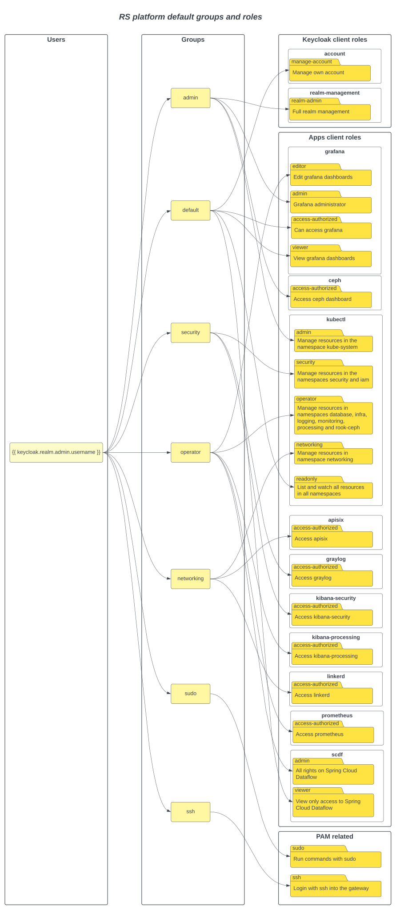

# Default Configuration

> Delivered configuration corresponds to a platform that can be used without processing chains. It covers the following points :
>
> - definition of system resources required for services
> - definition of sufficient storage for services
> - high availability of services
>
> When adding an RS-ADDON / RS-CORE, the following COTS will need to be re-configured:
>
> - Storage size for Elasticsearch processing
> - Storage size for Elasticsearch security
> - Storage size for Kafka
> - Storage size for Loki
> - Storage size for Rook Ceph

## Default network and infrastructure

- 2 public IPs for egress
- 2 publics IPs for the gateways
- 1 private network with all the machines
- 3 additional volumes of 2 TB for the Ceph filesystem
- 4 S3 buckets for ES processing, ES security, Thanos and Loki
- Platform with 20 nodes :
  - 2 Gateway (VM : 4 CPUs / 8 Go RAM)
  - 3 Master (VM : 4 CPUs / 8 Go RAM)
  - 8 Infra Worker (VM : 4 CPUs / 16 Go RAM)
  - 3 Ceph filesystem nodes (VM : 8 CPUs / 16 Go RAM)
  - 2 Specific Workers for Prometheus  (VM : 8 CPUs / 32 Go RAM)
  - 2 Egress (VM : 4 CPUs / 16 Go RAM)

## Configuration of COTS

|   |   |
| - | - |
| **Apisix** | - Namespace : networking   ------------------------   **apisix**   - QoS : Burstable   - Replicas : 3   - Ressources :   &nbsp;&nbsp;&nbsp; - Limits CPU : n/a   &nbsp;&nbsp;&nbsp; - Limits Memory : n/a   &nbsp;&nbsp;&nbsp; - Request CPU : 30m   &nbsp;&nbsp;&nbsp; - Request Memory : 256Mi   ------------------------   **dashboard**   - QoS : Burstable   - Replicas : 1   ------------------------   **etcd**   - QoS : Burstable   - Replicas : 3   - Persistent Volume :   &nbsp;&nbsp;&nbsp; - Size : 8Gi   &nbsp;&nbsp;&nbsp; - Access Mode : ReadWriteOnce   - Ressources :   &nbsp;&nbsp;&nbsp; - Limits CPU : n/a   &nbsp;&nbsp;&nbsp; - Limits Memory : 600Mi   &nbsp;&nbsp;&nbsp; - Request CPU : 20m   &nbsp;&nbsp;&nbsp; - Request Memory : 100Mi   ------------------------   **ingress controller**   - QoS : Burstable   - Replicas : 2   - Ressources :   &nbsp;&nbsp;&nbsp; - Limits CPU : 50m   &nbsp;&nbsp;&nbsp; - Limits Memory : 128Mi   &nbsp;&nbsp;&nbsp; - Request CPU : 10m   &nbsp;&nbsp;&nbsp; - Request Memory : 64Mi |
| **Calico** | - Namespace : kube-system   ------------------------   **calico**   - QoS : Burstable   - Replicas : Daemonset   - Ressources :   &nbsp;&nbsp;&nbsp; - Limits CPU : 300m   &nbsp;&nbsp;&nbsp; - Limits Memory : 500M   &nbsp;&nbsp;&nbsp; - Request CPU : 150m   &nbsp;&nbsp;&nbsp; - Request Memory : 64M   ------------------------   **kube-controller**   - QoS : Burstable   - Replicas : 1   - Ressources :   &nbsp;&nbsp;&nbsp; - Limits CPU : 100m   &nbsp;&nbsp;&nbsp; - Limits Memory : 256M   &nbsp;&nbsp;&nbsp; - Request CPU : 30m   &nbsp;&nbsp;&nbsp; - Request Memory : 64M |
| **Cert-manager** | - Namespace : infra   ------------------------   **cert-manager**   - QoS : Burstable   - Replicas : 1   - Ressources :   &nbsp;&nbsp;&nbsp; - Limits CPU : 20m   &nbsp;&nbsp;&nbsp; - Limits Memory : 100Mi   &nbsp;&nbsp;&nbsp; - Request CPU : 10m   &nbsp;&nbsp;&nbsp; - Request Memory : 50Mi   ------------------------   **cainjector**   - QoS : Burstable   - Replicas : 1   - Ressources :   &nbsp;&nbsp;&nbsp; - Limits CPU : 20m   &nbsp;&nbsp;&nbsp; - Limits Memory : 200Mi   &nbsp;&nbsp;&nbsp; - Request CPU : 10m   &nbsp;&nbsp;&nbsp; - Request Memory : 100Mi    ------------------------   **webhook**   - QoS : Burstable   - Replicas : 1   - Ressources :   &nbsp;&nbsp;&nbsp; - Limits CPU : 20m   &nbsp;&nbsp;&nbsp; - Limits Memory : 40Mi   &nbsp;&nbsp;&nbsp; - Request CPU : 10m   &nbsp;&nbsp;&nbsp; - Request Memory : 20Mi |
| **Cluster autoscaler** | - Namespace : kube-system   - QoS : Burstable   - Replicas : 1   - Ressources :   &nbsp;&nbsp;&nbsp; - Limits CPU : 1   &nbsp;&nbsp;&nbsp; - Limits Memory : 512Mi   &nbsp;&nbsp;&nbsp; - Request CPU : 100m   &nbsp;&nbsp;&nbsp; - Request Memory : 256Mi |
| **CoreDNS** | - Namespace : kube-system   ------------------------   **coredns**   - QoS : Burstable   - Replicas : 2   - Ressources :   &nbsp;&nbsp;&nbsp; - Limits Memory : 170Mi   &nbsp;&nbsp;&nbsp; - Request CPU : 100m   &nbsp;&nbsp;&nbsp; - Request Memory : 70Mi   ------------------------   **localdns**   - QoS: Burstable   - Replicas : Daemonset   - Ressources :   &nbsp;&nbsp;&nbsp; - Limits Memory : 170Mi   &nbsp;&nbsp;&nbsp; - Request CPU : 100m   &nbsp;&nbsp;&nbsp; - Request Memory : 70Mi   ------------------------   **dns autoscaler**   - QoS : Burstable   - Replicas : 1   - Ressources :   &nbsp;&nbsp;&nbsp; - Request CPU : 20m   &nbsp;&nbsp;&nbsp; - Request Memory : 10Mi |
| **Elastic Operator** | - Namespace : infra   - QoS : Burstable   - Replicas : 1  - Ressources :   &nbsp;&nbsp;&nbsp; - Limits CPU : 500m   &nbsp;&nbsp;&nbsp; - Limits Memory : 256Mi   &nbsp;&nbsp;&nbsp; - Request CPU : 100m   &nbsp;&nbsp;&nbsp; - Request Memory : 128Mi |
| **Elasticsearch processing** | - Namespace : database   - Priority Class : 900000   ------------------------   **coordinating**   - QoS : Burstable   - Replicas : 2   - Persistent Volume :   &nbsp;&nbsp;&nbsp; - Size : 1Gi   &nbsp;&nbsp;&nbsp; - Access Mode : ReadWriteOnce   - Ressources :   &nbsp;&nbsp;&nbsp; - Limits CPU : 500m   &nbsp;&nbsp;&nbsp; - Limits Memory : 6Gi   &nbsp;&nbsp;&nbsp; - Request CPU : 100m   &nbsp;&nbsp;&nbsp; - Request Memory : 4Gi   ------------------------   **data**   - QoS : Burstable   - Replicas : 3   - Persistent Volume :   &nbsp;&nbsp;&nbsp; - Size : 100Gi   &nbsp;&nbsp;&nbsp; - Access Mode : ReadWriteOnce   - Ressources :   &nbsp;&nbsp;&nbsp; - Limits CPU : 2   &nbsp;&nbsp;&nbsp; - Limits Memory : 8Gi   &nbsp;&nbsp;&nbsp; - Request CPU : 100m   &nbsp;&nbsp;&nbsp; - Request Memory : 4Gi   ------------------------   **exporter**   - QoS : Burstable   - Replicas : 1   - Ressources :   &nbsp;&nbsp;&nbsp; - Limits CPU : 100m   &nbsp;&nbsp;&nbsp; - Limits Memory : 256Mi   &nbsp;&nbsp;&nbsp; - Request CPU : 50m   &nbsp;&nbsp;&nbsp; - Request Memory : 128Mi |
| **Elasticsearch security**   | - Namespace : security   - Priority Class : 900000   ------------------------   **coordinating**   - QoS : Burstable   - Replicas : 2   - Persistent Volume :   &nbsp;&nbsp;&nbsp; - Size : 1Gi   &nbsp;&nbsp;&nbsp; - Access Mode : ReadWriteOnce   - Ressources :   &nbsp;&nbsp;&nbsp; - Limits CPU : 400m   &nbsp;&nbsp;&nbsp; - Limits Memory : 6Gi   &nbsp;&nbsp;&nbsp; - Request CPU : 100m   &nbsp;&nbsp;&nbsp; - Request Memory : 4Gi   ------------------------   **data**   - QoS : Burstable   - Replicas : 3   - Persistent Volume :   &nbsp;&nbsp;&nbsp; - Size : 100Gi   &nbsp;&nbsp;&nbsp; - Access Mode : ReadWriteOnce   - Ressources :   &nbsp;&nbsp;&nbsp; - Limits CPU : 2   &nbsp;&nbsp;&nbsp; - Limits Memory : 8Gi   &nbsp;&nbsp;&nbsp; - Request CPU : 100m   &nbsp;&nbsp;&nbsp; - Request Memory : 4Gi   ------------------------   **exporter**   - QoS : Burstable   - Replicas : 1   - Ressources :   &nbsp;&nbsp;&nbsp; - Limits CPU : 100m   &nbsp;&nbsp;&nbsp; - Limits Memory : 256Mi   &nbsp;&nbsp;&nbsp; - Request CPU : 50m   &nbsp;&nbsp;&nbsp; - Request Memory : 128Mi |
| **Etcd** | - Namespace : kube-system   - QoS : Burstable   - Replicas: 3   - Ressources :   &nbsp;&nbsp;&nbsp; - Request CPU : 100m   &nbsp;&nbsp;&nbsp; - Request Memory : 100Mi |
| **Falco** | - Namespace : security   - Priority Class : 10000000   - QoS : Burstable   - Replicas : Daemonset   - Ressources :   &nbsp;&nbsp;&nbsp; - Limits CPU : 200m   &nbsp;&nbsp;&nbsp; - Limits Memory : 256Mi   &nbsp;&nbsp;&nbsp; - Request CPU : 100m   &nbsp;&nbsp;&nbsp; - Request Memory : 50Mi |  
| **Falco Exporter** | - Namespace : security   - QoS : Burstable   - Replicas : Daemonset   - Ressources :   &nbsp;&nbsp;&nbsp; - Limits CPU : 10m   &nbsp;&nbsp;&nbsp; - Limits Memory : 20Mi   &nbsp;&nbsp;&nbsp; - Request CPU : 5m   &nbsp;&nbsp;&nbsp; - Request Memory : 10Mi |  
| **Fluentbit** | - Namespace : logging   - Priority Class : 10000000   - QoS : Burstable   - Replicas : Daemonset   - Ressources :   &nbsp;&nbsp;&nbsp; - Limits CPU : 150m   &nbsp;&nbsp;&nbsp; - Limits Memory : 512Mi   &nbsp;&nbsp;&nbsp; - Request CPU : 25m   &nbsp;&nbsp;&nbsp; - Request Memory : 64Mi |
| **Fluentd** | - Namespace : logging   - QoS : Burstable   - Replicas : 2   - Persistent Volume :    &nbsp;&nbsp;&nbsp; - Size : 10Gi   &nbsp;&nbsp;&nbsp; - Access Mode : ReadWriteOnce   - Ressources :   &nbsp;&nbsp;&nbsp; - Limits CPU : 500m   &nbsp;&nbsp;&nbsp; - Limits Memory : 512Mi   &nbsp;&nbsp;&nbsp; - Request CPU : 100m   &nbsp;&nbsp;&nbsp; - Request Memory : 256Mi |
| **Finops Object Storage Exporter** | - Namespace : monitoring   - QoS : BestEffort   - Replicas : 1 |
| **Finops Ressources Exporter** | - Namespace : monitoring   - QoS : Burstable   - Replicas : 1 |
| **Grafana** | - Namespace : monitoring   ------------------------   **grafana**   - QoS : Burstable   - Replicas : 1   - Persistent Volume :    &nbsp;&nbsp;&nbsp; - Size : 8Gi   &nbsp;&nbsp;&nbsp; - Access Mode : ReadWriteOnce   - Ressources :   &nbsp;&nbsp;&nbsp; - Limits CPU : 500m   &nbsp;&nbsp;&nbsp; - Limits Memory : 1Gi   &nbsp;&nbsp;&nbsp; - Request CPU : 200m   &nbsp;&nbsp;&nbsp; - Request Memory : 256Mi   -----------------------------    - QoS : Burstable   - Replicas : 1   ------   **manager**   - Ressources :   &nbsp;&nbsp;&nbsp; - Limits CPU : 400m   &nbsp;&nbsp;&nbsp; - Limits Memory : 512Mi   &nbsp;&nbsp;&nbsp; - Request CPU : 100m   &nbsp;&nbsp;&nbsp; - Request Memory : 256Mi   ------   **kube-rbac-proxy**   - Ressources :   &nbsp;&nbsp;&nbsp; - Limits CPU : 10m   &nbsp;&nbsp;&nbsp; - Limits Memory : 20Mi   &nbsp;&nbsp;&nbsp; - Request CPU : 5m   &nbsp;&nbsp;&nbsp; - Request Memory : 10Mi |
| **Graylog** | - Namespace : security   - QoS : Burstable   - Replicas : 2   - Persistent Volume :    &nbsp;&nbsp;&nbsp; - Size : 10Gi   &nbsp;&nbsp;&nbsp; - Access Mode : ReadWriteOnce   - Ressources :   &nbsp;&nbsp;&nbsp; - Limits CPU : 2   &nbsp;&nbsp;&nbsp; - Limits Memory : 2Gi   &nbsp;&nbsp;&nbsp; - Request CPU : 500m   &nbsp;&nbsp;&nbsp; - Request Memory : 1Gi |
| **Kafka Cluster** | - Namespace : infra   ------------------------   **operator**   - QoS : Burstable   - Replicas : 1   - Ressources :   &nbsp;&nbsp;&nbsp; - Limits CPU : 500m   &nbsp;&nbsp;&nbsp; - Limits Memory : 1Gi   &nbsp;&nbsp;&nbsp; - Request CPU : 100m   &nbsp;&nbsp;&nbsp; - Request Memory : 512Mi   ------------------------   **kafka**   - QoS : Burstable   - Replicas : 3   - Persistent Volume :    &nbsp;&nbsp;&nbsp; - Size : 200Gi   &nbsp;&nbsp;&nbsp; - Access Mode : ReadWriteOnce   - Ressources :   &nbsp;&nbsp;&nbsp; - Limits CPU : 1   &nbsp;&nbsp;&nbsp; - Limits Memory : 4Gi   &nbsp;&nbsp;&nbsp; - Request CPU : 200m   &nbsp;&nbsp;&nbsp; - Request Memory : 2Gi   ------------------------   **entity-operator**   - QoS : Burstable   - Replicas : 1   ------   **topic-operator**   - Ressources :   &nbsp;&nbsp;&nbsp; - Limits CPU : 200m   &nbsp;&nbsp;&nbsp; - Limits Memory : 400Mi   &nbsp;&nbsp;&nbsp; - Request CPU : 50m   &nbsp;&nbsp;&nbsp; - Request Memory : 200Mi   ------   **user-operator**   - Ressources :   &nbsp;&nbsp;&nbsp; - Limits CPU : 200m   &nbsp;&nbsp;&nbsp; - Limits Memory : 400Mi   &nbsp;&nbsp;&nbsp; - Request CPU : 50m   &nbsp;&nbsp;&nbsp; - Request Memory : 200Mi   ------------------------   **exporter**    - QoS : Burstable   - Replicas : 1   - Ressources :   &nbsp;&nbsp;&nbsp; - Limits CPU : 200m   &nbsp;&nbsp;&nbsp; - Limits Memory : 128Mi   &nbsp;&nbsp;&nbsp; - Request CPU : 40m   &nbsp;&nbsp;&nbsp; - Request Memory : 32Mi   ------------------------   **zookeeper**   - QoS : Burstable   - Replicas : 3   - Persistent Volume :    &nbsp;&nbsp;&nbsp; - Size : 50Gi   &nbsp;&nbsp;&nbsp; - Access Mode : ReadWriteOnce   - Ressources :   &nbsp;&nbsp;&nbsp; - Limits CPU : 200m   &nbsp;&nbsp;&nbsp; - Limits Memory : 1500Mi   &nbsp;&nbsp;&nbsp; - Request CPU : 100m   &nbsp;&nbsp;&nbsp; - Request Memory : 750Mi |
| **Keda** | --Namespace : infra   ------------------------   **operator**   - Replicas : 1   - Ressources :   &nbsp;&nbsp;&nbsp; - Limits CPU : 1   &nbsp;&nbsp;&nbsp; - Limits Memory : 1000Mi   &nbsp;&nbsp;&nbsp; - Request CPU : 100m   &nbsp;&nbsp;&nbsp; - Request Memory : 100Mi   ------------------------   **metrics apiserver**   - Replicas : 1   - Ressources :   &nbsp;&nbsp;&nbsp; - Limits CPU : 1   &nbsp;&nbsp;&nbsp; - Limits Memory : 1000Mi   &nbsp;&nbsp;&nbsp; - Request CPU : 100m   &nbsp;&nbsp;&nbsp; - Request Memory : 100Mi  |
| **Keycloak** | - Namespace : iam   - QoS : Burstable   - Replicas : 1   - Ressources :   &nbsp;&nbsp;&nbsp; - Limits CPU : 500m   &nbsp;&nbsp;&nbsp; - Limits Memory : 2Gi   &nbsp;&nbsp;&nbsp; - Request CPU : 250m   &nbsp;&nbsp;&nbsp; - Request Memory : 512Mi |
| **Kibana processing** | - Namespace : database   - QoS : Burstable   - Replicas : 1   - Ressources :   &nbsp;&nbsp;&nbsp; - Limits Memory : 1Gi   &nbsp;&nbsp;&nbsp;  - Request Memory : 1Gi |
| **Kibana security** | - Namespace : security   - QoS : Burstable   - Replicas : 1   - Ressources :   &nbsp;&nbsp;&nbsp; - Limits Memory : 1Gi   &nbsp;&nbsp;&nbsp;  - Request Memory : 1Gi |
| **Kubernetes** | - Namespace : kube-system   ------------------------   **kube-apiserver**   - QoS : Burstable   - Replicas : 3   - Ressources :   &nbsp;&nbsp;&nbsp; - Request CPU : 250m   ------------------------   **kube-controller-manager**   - QoS : Burstable   - Replicas : 3   - Ressources :   &nbsp;&nbsp;&nbsp; - Request CPU : 200m   ------------------------   **kube-scheduler**   - QoS : Burstable   - Replicas : 3   - Ressources :   &nbsp;&nbsp;&nbsp; - Request CPU : 100m   ------------------------   **nginx-proxy**   - QoS : Burstable   - Replicas : Daemonset   - Ressources :   &nbsp;&nbsp;&nbsp; - Request CPU : 25m   &nbsp;&nbsp;&nbsp; - Request Memory : 32m |
| **Linkerd** | - Namespace : networking   ------------------------   **linkerd-destination**   - QoS : Burstable   - Replicas : 3   ------   **destination**   - Ressources :   &nbsp;&nbsp;&nbsp; - Limits CPU : 50m    &nbsp;&nbsp;&nbsp; - Limits Memory : 200Mi   &nbsp;&nbsp;&nbsp; - Request CPU : 10m   &nbsp;&nbsp;&nbsp; - Request Memory : 100Mi   ------   **sp-validator**   - Ressources :   &nbsp;&nbsp;&nbsp; - Limits CPU : 10m    &nbsp;&nbsp;&nbsp; - Limits Memory : 56Mi   &nbsp;&nbsp;&nbsp; - Request CPU : 5m   &nbsp;&nbsp;&nbsp; - Request Memory : 28Mi   ------   **policy**   - Ressources :   &nbsp;&nbsp;&nbsp; - Limits CPU : 10m    &nbsp;&nbsp;&nbsp; - Limits Memory : 56Mi   &nbsp;&nbsp;&nbsp; - Request CPU : 5m   &nbsp;&nbsp;&nbsp; - Request Memory : 28Mi   ------------------------   **linkerd-identity**   - QoS : Burstable   - Replicas : 3   - Ressources :   &nbsp;&nbsp;&nbsp; - Limits CPU : 50Mi   &nbsp;&nbsp;&nbsp; - Limits Memory : 64Mi   &nbsp;&nbsp;&nbsp; - Request CPU : 10m   &nbsp;&nbsp;&nbsp; - Request Memory : 32Mi   ------------------------   **linkerd-proxy-injector**   - QoS : Burstable   - Replicas : 3   - Ressources :   &nbsp;&nbsp;&nbsp; - Limits CPU : 50Mi   &nbsp;&nbsp;&nbsp; - Limits Memory : 144Mi   &nbsp;&nbsp;&nbsp; - Request CPU : 10m   &nbsp;&nbsp;&nbsp; - Request Memory : 72Mi   ------------------------   **metrics-api**   - QoS : Burstable   - Replicas : 1   - Ressources :   &nbsp;&nbsp;&nbsp; - Limits CPU : 50m    &nbsp;&nbsp;&nbsp; - Limits Memory : 128Mi   &nbsp;&nbsp;&nbsp; - Request CPU : 5m   &nbsp;&nbsp;&nbsp; - Request Memory : 64Mi   ------------------------   **tap**   - QoS : Burstable   - Replicas : 1   - Ressources :   &nbsp;&nbsp;&nbsp; - Limits CPU : 20m    &nbsp;&nbsp;&nbsp; - Limits Memory : 200Mi   &nbsp;&nbsp;&nbsp; - Request CPU : 10m   &nbsp;&nbsp;&nbsp; - Request Memory : 100Mi   ------------------------   **tap-injector**   - QoS : Burstable   - Replicas : 1   - Ressources :   &nbsp;&nbsp;&nbsp; - Limits CPU : 10m    &nbsp;&nbsp;&nbsp; - Limits Memory : 40Mi   &nbsp;&nbsp;&nbsp; - Request CPU : 5m   &nbsp;&nbsp;&nbsp; - Request Memory : 20Mi   ------------------------   **web**   - QoS : Burstable   - Replicas : 1   - Ressources :   &nbsp;&nbsp;&nbsp; - Limits CPU : 10m    &nbsp;&nbsp;&nbsp; - Limits Memory : 64Mi   &nbsp;&nbsp;&nbsp; - Request CPU : 5m   &nbsp;&nbsp;&nbsp; - Request Memory : 32Mi   ------------------------   **linkerd-proxy**   - Replicas : Sidecar (several namespaces)   - Ressources :   &nbsp;&nbsp;&nbsp; - Limits CPU : 100m   &nbsp;&nbsp;&nbsp; - Limits Memory : 250Mi   &nbsp;&nbsp;&nbsp; - Request CPU : 50m   &nbsp;&nbsp;&nbsp; - Request Memory : 20Mi |
| **Loki distributed** | - Namespace : logging   ------------------------   **ingester**   - QoS : Burstable   - Replicas : 3-15   - Persistent Volume :    &nbsp;&nbsp;&nbsp; - Size : 20Gi   &nbsp;&nbsp;&nbsp; - Access Mode : ReadWriteOnce   - Ressources :   &nbsp;&nbsp;&nbsp; - Limits CPU : 250m   &nbsp;&nbsp;&nbsp; - Limits Memory : 1Gi   &nbsp;&nbsp;&nbsp; - Request CPU : 100m   &nbsp;&nbsp;&nbsp; - Request Memory : 512Mi   ------------------------   **querier**   - QoS : Burstable   - Replicas : 3   - Persistent Volume :    &nbsp;&nbsp;&nbsp; - Size : 20Gi   &nbsp;&nbsp;&nbsp; - Access Mode : ReadWriteOnce   - Ressources :   &nbsp;&nbsp;&nbsp; - Limits CPU : 1   &nbsp;&nbsp;&nbsp; - Limits Memory : 2Gi   &nbsp;&nbsp;&nbsp; - Request CPU : 50m   &nbsp;&nbsp;&nbsp; - Request Memory : 128Mi   ------------------------   **distributor**   - Ressources :   &nbsp;&nbsp;&nbsp; - Limits CPU : 300m   &nbsp;&nbsp;&nbsp; - Limits Memory : 256Mi   &nbsp;&nbsp;&nbsp; - Request CPU : 100m   &nbsp;&nbsp;&nbsp; - Request Memory : 128Mi   ------------------------   **compactor**   - Ressources :   &nbsp;&nbsp;&nbsp; - Limits CPU : 100m   &nbsp;&nbsp;&nbsp; - Limits Memory : 256Mi   &nbsp;&nbsp;&nbsp; - Request CPU : 20m   &nbsp;&nbsp;&nbsp; - Request Memory : 64Mi   ------------------------   **queryFrontend**    - QoS : Burstable   - Replicas : 2   - Ressources :   &nbsp;&nbsp;&nbsp; - Limits CPU : 100m   &nbsp;&nbsp;&nbsp; - Limits Memory : 256Mi   &nbsp;&nbsp;&nbsp; - Request CPU : 40m   &nbsp;&nbsp;&nbsp; - Request Memory : 64Mi |
| **MongoDB** | - Namespace : database   -----------------------------   - QoS : Burstable   - Replicas : 3    ------   **mongodb**   - Persistent Volume :    &nbsp;&nbsp;&nbsp; - Size : 30Gi   &nbsp;&nbsp;&nbsp; - Access Mode : ReadWriteOnce   - Ressources :   &nbsp;&nbsp;&nbsp; - Limits CPU : 300m   &nbsp;&nbsp;&nbsp; - Limits Memory : 2Gi   &nbsp;&nbsp;&nbsp; - Request CPU : 100m   &nbsp;&nbsp;&nbsp; - Request Memory : 512Mi   ------   **metrics**   - Ressources :   &nbsp;&nbsp;&nbsp; - Limits CPU : 50m   &nbsp;&nbsp;&nbsp; - Limits Memory : 128Mi   &nbsp;&nbsp;&nbsp; - Request CPU : 20m   &nbsp;&nbsp;&nbsp; - Request Memory : 64Mi   -----------------------------   **arbiter**   - QoS : Burstable   - Replicas : 1 |
| **OpenLDAP** | - Namespace : iam   - QoS : Burstable   - Replicas : 2   - Persistent Volume :    &nbsp;&nbsp;&nbsp; - Size : 8Gi   &nbsp;&nbsp;&nbsp; - Access Mode : ReadWriteOnce   - Ressources :   &nbsp;&nbsp;&nbsp; - Limits CPU : 50m   &nbsp;&nbsp;&nbsp; - Limits Memory : 128Mi   &nbsp;&nbsp;&nbsp; - Request CPU : 10m   &nbsp;&nbsp;&nbsp; - Request Memory : 72Mi |
| **PostgreSQL** | - Namespace : database   -----------------------------   **primary**   - QoS : Burstable   - Replicas : 1   - Persistent Volume :    &nbsp;&nbsp;&nbsp; - Size : 30Gi   &nbsp;&nbsp;&nbsp; - Access Mode : ReadWriteOnce   - Ressources :   &nbsp;&nbsp;&nbsp; - Limits CPU : 250m   &nbsp;&nbsp;&nbsp; - Limits Memory : 2Gi   &nbsp;&nbsp;&nbsp; - Request CPU : 50m   &nbsp;&nbsp;&nbsp; - Request Memory : 512Mi   -----------------------------   **read**   - QoS : Burstable   - Replicas : 2   - Persistent Volume :    &nbsp;&nbsp;&nbsp; - Size : 30Gi   &nbsp;&nbsp;&nbsp; - Access Mode : ReadWriteOnce   - Ressources :   &nbsp;&nbsp;&nbsp; - Limits CPU : 250m   &nbsp;&nbsp;&nbsp; - Limits Memory : 2Gi   &nbsp;&nbsp;&nbsp; - Request CPU : 50m   &nbsp;&nbsp;&nbsp; - Request Memory : 512Mi |
| **PostgreSQL Exporter** | - Namespace : database   -----------------------------   **Keycloak Exporter**   - QoS : Burstable   - Replicas : 1   -----------------------------   **Spring Cloud Data Flow Exporter**   - QoS : Burstable   - Replicas : 1   -----------------------------   **Spring Cloud Data Flow Skipper Exporter**   - QoS : Burstable   - Replicas : 1 |
| **Prometheus Operator** | - Namespace : infra   - QoS : Burstable   - Replicas : 1   - Ressources :   &nbsp;&nbsp;&nbsp; - Limits CPU : 50m   &nbsp;&nbsp;&nbsp; - Limits Memory : 256Mi   &nbsp;&nbsp;&nbsp; - Request CPU : 10m   &nbsp;&nbsp;&nbsp; - Request Memory : 128Mi |
| **Prometheus Stack** | - Namespace : logging   - Priority Class : 1000000   -----------------------------   - QoS : Burstable   - Replicas : 1   ------   **alertmanager**   - Ressources :   &nbsp;&nbsp;&nbsp; - Limits CPU : 50m   &nbsp;&nbsp;&nbsp; - Limits Memory : 128Mi   &nbsp;&nbsp;&nbsp; - Request CPU : 10m   &nbsp;&nbsp;&nbsp; - Request Memory : 64Mi   -----   **config-reloader**   - Ressources :   &nbsp;&nbsp;&nbsp; - Limits CPU : 10m   &nbsp;&nbsp;&nbsp; - Limits Memory : 64Mi   &nbsp;&nbsp;&nbsp; - Request CPU : 10m   &nbsp;&nbsp;&nbsp; - Request Memory : 64Mi   -----------------------------   - QoS : Burstable   - Replicas : 2   ------   **prometheus**  - Persistent Volume :    &nbsp;&nbsp;&nbsp; - Size : 20Gi   &nbsp;&nbsp;&nbsp; - Access Mode : ReadWriteOnce   - Ressources :   &nbsp;&nbsp;&nbsp; - Limits CPU : 4   &nbsp;&nbsp;&nbsp; - Limits Memory : 20Gi   &nbsp;&nbsp;&nbsp; - Request CPU : 2   &nbsp;&nbsp;&nbsp; - Request Memory : 8Gi   ----   **config-reloader**   - Ressources :   &nbsp;&nbsp;&nbsp; - Limits CPU : 10m   &nbsp;&nbsp;&nbsp; - Limits Memory : 64Mi   &nbsp;&nbsp;&nbsp; - Request CPU : 10m   &nbsp;&nbsp;&nbsp; - Request Memory : 64Mi   -----------------------------   **kube-state-metrics**   - QoS : Burstable   - Replicas : 1   ----------------------------   **node-exporter**   - QoS : Burstable   - Replicas : Daemonset   - Ressources :   &nbsp;&nbsp;&nbsp; - Limits CPU : 30m   &nbsp;&nbsp;&nbsp; - Limits Memory : 60Mi   &nbsp;&nbsp;&nbsp; - Request CPU : 15m   &nbsp;&nbsp;&nbsp; - Request Memory : 30Mi   ----------------------------   **thanos-sidecar**   - Replicas : Sidecar   - Ressources :   &nbsp;&nbsp;&nbsp; - Limits CPU : 100m   &nbsp;&nbsp;&nbsp; - Limits Memory : 2Gi   &nbsp;&nbsp;&nbsp; - Request CPU : 25m   &nbsp;&nbsp;&nbsp; - Request Memory : 512Mi   ----------------------------   **thanos-compactor**   - QoS : Burstable   - Replicas : 1   - Persistent Volume :    &nbsp;&nbsp;&nbsp; - Size : 100Gi   &nbsp;&nbsp;&nbsp; - Access Mode : ReadWriteOnce   - Ressources :   &nbsp;&nbsp;&nbsp; - Limits CPU : 500m   &nbsp;&nbsp;&nbsp; - Limits Memory : 2Gi   &nbsp;&nbsp;&nbsp; - Request CPU : 100m   &nbsp;&nbsp;&nbsp; - Request Memory : 512Mi   ----------------------------   **thanos-query**   - QoS : Burstable   - Replicas : 1   - Ressources :   &nbsp;&nbsp;&nbsp; - Limits CPU : 500m   &nbsp;&nbsp;&nbsp; - Limits Memory : 2Gi   &nbsp;&nbsp;&nbsp; - Request CPU : 100m   &nbsp;&nbsp;&nbsp; - Request Memory : 512Mi   ----------------------------   **thanos-storegateway**   - QoS : Burstable   - Replicas : 1   - Ressources :   &nbsp;&nbsp;&nbsp; - Limits CPU : 500m   &nbsp;&nbsp;&nbsp; - Limits Memory : 2Gi   &nbsp;&nbsp;&nbsp; - Request CPU : 100m   &nbsp;&nbsp;&nbsp; - Request Memory : 512Mi |
| **Rclone** | - Namespace : security   - QoS : BestEffort   - Replicas : CronJob |
| **Rook Ceph** | - Namespace : rook-ceph   - Priority Class : 10000000   - Ceph Block Pools Replicated : 3   ----------------------------   **csi-rbdplugin**   - QoS : Burstable   - Replicas : Daemonset   ------   **driver-registrar**  - Ressources :   &nbsp;&nbsp;&nbsp; - Limits CPU : 20m   &nbsp;&nbsp;&nbsp; - Limits Memory : 20Mi   &nbsp;&nbsp;&nbsp; - Request CPU : 10m   &nbsp;&nbsp;&nbsp; - Request Memory : 10Mi   ------   **csi-rbdplugin**   - Ressources :   &nbsp;&nbsp;&nbsp; - Limits CPU : 10m   &nbsp;&nbsp;&nbsp; - Limits Memory : 200Mi   &nbsp;&nbsp;&nbsp; - Request CPU : 5m   &nbsp;&nbsp;&nbsp; - Request Memory : 100Mi   ------   **liveness-prometheus**  - Ressources :   &nbsp;&nbsp;&nbsp; - Limits CPU : 10m   &nbsp;&nbsp;&nbsp; - Limits Memory : 40Mi   &nbsp;&nbsp;&nbsp; - Request CPU : 5m   &nbsp;&nbsp;&nbsp; - Request Memory : 20Mi   ----------------------------   **csi-rbdplugin-provisioner**   - QoS : Burstable   - Replicas : 2   ------   **csi-provisioner**   ------   **csi-resizer**   ------   **csi-attacher**   ------   **csi-snapshotter**   ------   **csi-rdbplugin**   ------   **liveness-prometheus**   ----------------------------   **rook-ceph-operator**   - QoS : Burstable   - Replicas : 1   - Ressources :   &nbsp;&nbsp;&nbsp; - Limits CPU : n/a   &nbsp;&nbsp;&nbsp; - Limits Memory : 256Mi   &nbsp;&nbsp;&nbsp; - Request CPU : 100m   &nbsp;&nbsp;&nbsp; - Request Memory : 128Mi   ----------------------------   - QoS : Burstable   - Replicas : 2   ------   **mgr**   - Ressources :   &nbsp;&nbsp;&nbsp; - Limits CPU : 500m   &nbsp;&nbsp;&nbsp; - Limits Memory : 1Gi   &nbsp;&nbsp;&nbsp; - Request CPU : 500m   &nbsp;&nbsp;&nbsp; - Request Memory : 1Gi   ------  **watch-active**   ----------------------------   **mon**   - QoS : Burstable   - Replicas : 3   - Ressources :   &nbsp;&nbsp;&nbsp; - Limits CPU : 500m   &nbsp;&nbsp;&nbsp; - Limits Memory : 1Gi   &nbsp;&nbsp;&nbsp; - Request CPU : 500m   &nbsp;&nbsp;&nbsp; - Request Memory : 1Gi   ----------------------------   **rook-ceph-crashcollector**   - QoS : Burstable   - Replicas : Daemonset   ----------------------------   **osd**   - QoS : Guaranteed   - Replicas : Daemonset   - Ressources :   &nbsp;&nbsp;&nbsp; - Limits CPU : 1   &nbsp;&nbsp;&nbsp; - Limits Memory : 2Gi   &nbsp;&nbsp;&nbsp; - Request CPU : 1   &nbsp;&nbsp;&nbsp; - Request Memory : 2Gi    ----------------------------   **rook-ceph-tools**   - QoS : Burstable   - Replicas : 1 |
| **RS Infra Scaler** | - Namespace : kube-system   - QoS : Burstable   - Replicas : 1   - Ressources :   &nbsp;&nbsp;&nbsp; - Limits CPU : 1   &nbsp;&nbsp;&nbsp; - Limits Memory : 512Mi   &nbsp;&nbsp;&nbsp; - Request CPU : 200m   &nbsp;&nbsp;&nbsp; - Request Memory : 256Mi |
| **SafeScale daemon** | - Namespace : kube-system   - QoS : Burstable   - Replicas : 1   - Ressources :   &nbsp;&nbsp;&nbsp; - Limits CPU : 1   &nbsp;&nbsp;&nbsp; - Limits Memory : 512Mi   &nbsp;&nbsp;&nbsp; - Request CPU : 100m   &nbsp;&nbsp;&nbsp; - Request Memory : 256Mi |
| **Spring Cloud Data Flow** | - Namespace : processing   ----------------------------   **server**   - QoS : Burstable   - Replicas : 1   - Ressources :   &nbsp;&nbsp;&nbsp; - Limits CPU : 1   &nbsp;&nbsp;&nbsp; - Limits Memory : 2Gi   &nbsp;&nbsp;&nbsp; - Request CPU : 500m   &nbsp;&nbsp;&nbsp; - Request Memory : 1Gi   ----------------------------   **skipper**   - QoS : Burstable   - Replicas : 1   - Ressources :   &nbsp;&nbsp;&nbsp; - Limits CPU : 1   &nbsp;&nbsp;&nbsp; - Limits Memory : 2Gi   &nbsp;&nbsp;&nbsp; - Request CPU : 500m   &nbsp;&nbsp;&nbsp; - Request Memory : 1Gi   ----------------------------   **prometheus-proxy**   - QoS : Burstable   - Replicas : 1   - Ressources :   &nbsp;&nbsp;&nbsp; - Limits CPU : 500m   &nbsp;&nbsp;&nbsp; - Limits Memory : 256Mi   &nbsp;&nbsp;&nbsp; - Request CPU : 100m   &nbsp;&nbsp;&nbsp; - Request Memory : 128Mi |  
| **Stash** | - Namespace : infra   - QoS : Burstable   - Replicas : 1   ------   **operator**   - Ressources :   &nbsp;&nbsp;&nbsp; - Limits CPU : 100m   &nbsp;&nbsp;&nbsp; - Limits Memory : 512Mi   &nbsp;&nbsp;&nbsp; - Request CPU : 50m   &nbsp;&nbsp;&nbsp; - Request Memory : 128Mi    ------   **pushgateway**   - Ressources :   &nbsp;&nbsp;&nbsp; - Limits CPU : 100m   &nbsp;&nbsp;&nbsp; - Limits Memory : 128Mi   &nbsp;&nbsp;&nbsp; - Request CPU : 50m   &nbsp;&nbsp;&nbsp; - Request Memory : 64Mi |
| **Kubelet rubber stamp** | - Namespace : kube-system   - QoS : Burstable   - Replicas : 1   - Ressources :   &nbsp;&nbsp;&nbsp; - Limits CPU : 50m   &nbsp;&nbsp;&nbsp; - Limits Memory : 20Mi   &nbsp;&nbsp;&nbsp; - Request CPU : 10m   &nbsp;&nbsp;&nbsp; - Request Memory : 10Mi |

## Predefined user, groups and client roles

## Exposed services

| Exposed service | URL subdomain | URL subpath | Notes |
| --------------- | ------------- | ----------- | ----- |
| apisix | apisix | /* | |
| kube-apiserver | kube | /* | |
| linkerd | linkerd | /* | |
| grafana | monitoring | /* | |
| prometheus | monitoring | /prometheus | |
| thanos | monitoring | /thanos/ | |
| kibana processing | processing | /kibana | |
| spring cloud dataflow | processing | /* | |
| kibana security | security | /kibana | |
| graylog | security | /* | |
| keycloack | iam | /auth/admin/RS/console | for users of group _admin_ |
| keycloack | iam | /auth/realms/RS/account | for all users |
| ceph dashboard | ceph | /* | admin password in the 'rook-ceph-dashboard-password' secret |

## ETL

| Source (Logs) | Topics (Kafka) | Consumer | Nb consumer | Destination |
| ------------- | :------------: | :------: | :---------: | ----------- |
| /var/log/containers/\*.log   Excluded :   &nbsp;&nbsp;&nbsp;&nbsp;&nbsp;- /var/log/containers/\*fluent\*.log   &nbsp;&nbsp;&nbsp;&nbsp;&nbsp;- /var/log/containers/keycloak-?_iam_keycloak-\*.log   &nbsp;&nbsp;&nbsp;&nbsp;&nbsp;- /var/log/containers/apisix-\*_networking_apisix-\*.log   &nbsp;&nbsp;&nbsp;&nbsp;&nbsp;- /var/log/containers/falco-?????_security_falco\*.log   &nbsp;&nbsp;&nbsp;&nbsp;&nbsp;- /var/log/containers/nmap-job-\*.log    **All logs** | -- | -- | -- | Loki |
| /var/log/containers/\*.log   Excluded :   &nbsp;&nbsp;&nbsp;&nbsp;&nbsp;- /var/log/containers/\*fluent\*.log   &nbsp;&nbsp;&nbsp;&nbsp;&nbsp;- /var/log/containers/keycloak-?_iam_keycloak-\*.log   &nbsp;&nbsp;&nbsp;&nbsp;&nbsp;- /var/log/containers/apisix-\*_networking_apisix-\*.log   &nbsp;&nbsp;&nbsp;&nbsp;&nbsp;- /var/log/containers/falco-?????_security_falco\*.log   &nbsp;&nbsp;&nbsp;&nbsp;&nbsp;- /var/log/containers/nmap-job-\*.log    **Only log JSON contains : `header.type: REPORT`** | fluentbit.trace | fluentd | 2 | Elasticsearch Processing |
| /var/log/syslog    **Exclude `syslog_identifier clamd`**| -- | -- | -- | Loki |
| /var/log/containers/keycloak-?_iam_keycloak-\*.log | fluentbit.keycloak | graylog | 2 | Elasticsearch Security |
| /var/log/containers/apisix-\*_networking_apisix-\*.log | fluentbit.ingress | graylog | 2 | Elasticsearch Security |
| /var/ossec/logs/alerts/alerts.json | fluentbit.wazuh | graylog | 2 | Elasticsearch Security |
| /var/log/audit_\*.log | fluentbit.auditd | graylog | 2 | Elasticsearch Security |
| /var/log/containers/falco-?????_security_falco\*.log | fluentbit.falco | graylog | 2 | Elasticsearch Security |

## Kafka Topics

| Topic | Partition | Replication Factor | Segment Size (bytes) | Retention (time in ms) | Retention (size in bytes) | Cleanup Policy | Min Insync Replicas | Unclean Leader Election Enabled |
| -- | :--: | :--: | :--: | :--: | :--: | :--: | :--: | :--: |
| fluentbit.auditd | 6 | 3 | 1789956970 | | 715827882 | delete | 2 | false |
| fluentbit.falco | 6 | 3 | 1789956970 | | 715827882 | delete | 2 | false |
| fluentbit.ingress | 6 | 3 | 1789956970 | | 715827882 | delete | 2 | false |
| fluentbit.keycloak | 6 | 3 | 1789956970 | | 715827882 | delete | 2 | false |
| fluentbit.trace | 6 | 3 | 89478485 | 604800000 | | delete | 2 | false |
| fluentbit.wazuh | 6 | 3 | 1789956970 | | 715827882 | delete | 2 | false |

## Logs and metrics retention

| Destination | Retention | Infos |
| ----------- | --------- | ----- |
| Loki S3 bucket | 1460h (~60d) | ||
| Prometheus | 2d | metrics are saved in S3 via Thanos |
| Thanos S3 bucket | 30d | 5m resolution |
| Thanos S3 bucket | 10 years | 1h resolution |
| Elasticsearch processing | lifetime retention | |
| Elasticsearch security | 6 months | |
