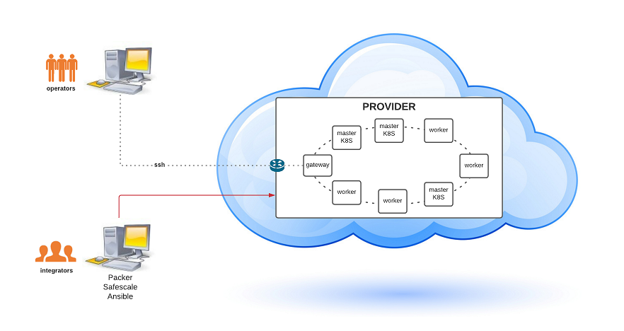

:arrow_heading_up: Go back to the [Reference System Sotfware repository](https://github.com/COPRS/reference-system-software) :arrow_heading_up:  
# How To

## Overview


> **Integrators' machine is called BASTION in the rest of the installation manual**

## _Bastion_ requirements

- Safescale : **>= v21.11.0** (https://github.com/CS-SI/SafeScale)
- openstacksdk : **>= v0.12.0** (https://pypi.org/project/openstacksdk/)
- qemu-system : **>= v4.2.1** (https://packages.ubuntu.com/focal/qemu-kvm / https://packages.ubuntu.com/focal/qemu-system-x86)
- Packer : **>= v1.7.8** (https://github.com/hashicorp/packer)

## Infrastructure requirements

- A **domain name** publicly available.  
  Replace all occurences of ```DOMAIN_NAME``` in the repo by your own domain name.
- A **load balancer** listening on a public IP address.  
  Configure the load balancer to forward incoming flow toward the cluster masters.

  | Load balancer port | masters port |
  | :---: | :---: |
  | 80 | 32080 |
  | 443 | 32443 |


## Quickstart

```Bash
## ON BASTION

# get the infrastructure repository
git clone https://github.com/COPRS/infrastructure.git

cd infrastructure

# install requirements
git submodule update --init
python3 -m pip install --user -r collections/kubespray/requirements.txt
ansible-galaxy collection install \
    kubernetes.core \
    openstack.cloud

# Copy ``inventory/sample`` as ``inventory/mycluster``
cp -rfp inventory/sample inventory/mycluster

# Review and change paramters under ``inventory/mycluster/group_vars`` or ``inventory/mycluster/host_vars``
cat inventory/mycluster/host_vars/localhost/cluster.yaml
cat inventory/mycluster/host_vars/localhost/image.yaml
cat inventory/mycluster/group_vars/all/kubespray.yaml
cat inventory/mycluster/group_vars/bastion/apps.yaml

# If needed create an image for the machines with Packer
ansible-playbook image.yaml \
    -i inventory/mycluster/hosts.ini

# Deploy machines with safescale
ansible-playbook cluster-setup.yaml \
    -i inventory/mycluster/hosts.ini

# Install security services
ansible-playbook security.yaml \
    -i inventory/mycluster/hosts.ini \
    --become

# Deploy kubernetes with Kubespray - run the playbook as root
# The option `--become` is required, for example writing SSL keys in /etc/,
# installing packages and interacting with various systemd daemons.
# Without --become the playbook will fail to run!
ansible-playbook collections/kubespray/cluster.yml \
    -i inventory/mycluster/hosts.ini \
    --become

# Enable pod security policies on the cluster
# /!\ you first need to create the psp and crb resources
# before enabling the admission plugin
ansible-playbook collections/kubespray/upgrade-cluster.yml \
    -i inventory/mycluster/hosts.ini \
    --tags cluster-roles \
    -e podsecuritypolicy_enabled=true \
    --become

ansible-playbook collections/kubespray/upgrade-cluster.yml \
    -i inventory/mycluster/hosts.ini \
    --tags master \
    -e podsecuritypolicy_enabled=true \
    --become

# Prepare the cluster for Reference System
ansible-playbook rs-setup.yaml \
    -i inventory/mycluster/hosts.ini

# deploy apps
ansible-playbook apps.yaml \
    -i inventory/mycluster/hosts.ini

# Install graylog content packs (Optionnal)
ansible-playbook configure-graylog.yaml \
    -i inventory/mycluster/hosts.ini
```

## TLS configuration

Reference System exploits APISIX Ingress Controller and Cert Manager for TLS configuration.

You need to create an [issuer](https://cert-manager.io/docs/concepts/issuer/) and a [certificate](https://cert-manager.io/docs/concepts/certificate/) for your domain name with Cert Manager.

APISIX does not work with Cert Manager for ACME HTTP01 challenges ([#781](https://github.com/apache/apisix-ingress-controller/issues/781)).  
You must use the DNS01 challenge to generate a Let's encrypt certificate. The configuration is detailled on [Cert Manager documentation](https://cert-manager.io/docs/configuration/acme/dns01).


## Dependencies

This project exploits Kubespray to deploy Kubernetes.  
The fully detailed documentation and configuration options are available on its page: [https://kubespray.io/](https://kubespray.io/#/)

## Tree view
The repository is made of the following main directories.
- apps
- doc
- platform
### Apps
This folder gathers the configuration of the applications deployed on the platform.  
Each application has its own folder inside apps with the values of the Helm chart, the kustomization files, the patches related, and any additional kubernetes resources.  
The application's directory can be split by environment with subfolders like dev, prod, etc.
### Doc
Here we find all the documentation describing the infrastructure deployment and maintenance operations.
### Platform
This directory concentrates what is required to deploy the infrastructure with Ansible.
- **collections/kubespray**: folder where kubespray is integrated into the project as a git submodule.
    - `cluster.yaml` the Ansible playbook to run to deploy Kubernetes.
- **inventory**: 
    - **sample**: Ansible inventory for sample configuration.
        - **group_vars**:
            - `all/kubespray.yaml`: kubespray configuration.
            - `bastion/app_installer.yaml`: application installer configuration: helm version, repositories, applications directory paths
        - **host_vars/localhost**: safescale cluster configuration and image configuration.
        - `hosts.ini`: host inventory.
- **playbooks**: list of Ansible playbooks to run to deploy the platform.
    - `clean.yaml`: remove the generated files by the different playbooks, delete the cluster and remove the volumes.
    - `cluster-setup.yaml`: deploy the network, the machines and the volumes with safescale.
    - `image.yaml`: build the image used to create the machines.
    - `rs-setup.yaml`: prepare the necessary resources for the platform.
    - `apps.yaml`: deploy the applications.
    - `security.yaml`: deploy the security services.
    - `configure-graylog.yaml`: upload and install graylog content-packs located in apps/graylog/config/content-packs/
- **roles**: list of roles used to deploy the cluster.
    - **security**: roles describing the installation of the different security tools.
- `ansible.cfg`: Ansible configuration file. It includes the ssh configuration to allow Ansible to access the machines through the gateway.

## Playbooks

| name | tags | utility | 
|---|---|---|
| cluster-setup.yaml | *none* <br> cluster_create <br> hosts_update <br> volumes_create | *all tags below are executed* <br> create safescale cluster <br> update hosts.ini with newly created machines, fill .ssh folder with machines ssh public keys, generate ansible ssh config, update config.cfg <br> attach disks to kubernetes nodes |
| delete.yaml <br> :warning: this playbook has been developed with the only purpose of testing the project **not for production usage**| *none* <br> cleanup_generated <br> detach_volumes <br> delete_volumes <br> delete_cluster | *nothing* <br> **remove** ssh keys, added hosts in hosts.ini, ssh config file <br> detach added disks from k8s nodes <br> delete added disks from k8s nodes <br> delete safescale cluster|
| image.yaml | *none* | *make reference system golden image for k8s nodes* |
|rs-setup.yaml | *none* <br> gateway <br> apps | *all tags below are executed* <br> install tools on gateways <br> configure the cluster |
| apps.yaml | *none* |  *deploy applications (adding -e name=APP_NAME deploy only the app matching APP_NAME)* |
| security.yaml | *none* <br> auditd <br> wazuh <br> clamav <br> openvpn <br> suricata <br> uninstall_APP_NAME| *install all security tools* <br> install auditd <br> install wazuh <br> install clamav <br> install openvpn <br> install suricata <br> uninstall the app matching APP_NAME

## Apps

Configurations proposed by default :
- **Rook Ceph** 
  - Chart Helm 
    - URL : charts.rook.io/release
    - Version : 1.7.7
    - Documentation : https://github.com/rook/rook/blob/master/Documentation/helm-operator.md
  - Images
    - Ceph
      - Registry : Docker Hub
      - Repository : ceph
      - Version : 1.7.7
    - CSI
      - Ceph
        - Registry : quay.io
        - Version : 3.4.0
      - Registrar
        - Registry : k8s.gcr.io
        - Version : 2.3.0
      - Resizer
        - Registry : k8s.gcr.io
        - Version : 1.3.0
      - Provisioner
        - Registry : k8s.gcr.io
        - Version : 3.0.0
      - Snapshotter
        - Registry : k8s.gcr.io
        - Version : 4.2.0
      - Attacher
        - Registry : k8s.gcr.io
        - Version : 3.3.0
      - Volume Replication
        - Registry : quay.io
        - Version : 0.1.0
- **Rook Ceph Cluster**
  - Chart Helm
    - URL : charts.rook.io/release
    - Version : 1.7.7
    - Documentation : https://github.com/rook/rook/blob/master/Documentation/helm-ceph-cluster.md
  - Image
    - Registry : quay.io
    - Version : 16.2.6
- **Kafka Operator**
  - Chart Helm
    - URL : strimzi.io/charts/
    - Version : 0.26.0
    - Documentation : https://github.com/strimzi/strimzi-kafka-operator/tree/main/helm-charts/helm3/strimzi-kafka-operator
  - Images
    - Registry : quai.io
    - Versions
      - Operator : 0.26.0
      - Kafka : 2.8.1
      - Zookeeper : 3.5.9
- **Elasticsearch Operator**
  - Chart Helm
    - URL : helm.elastic.co
    - Version : 1.9.0
    - Source : https://github.com/elastic/cloud-on-k8s/tree/master/deploy/eck-operator
  - Images
    - Registry : docker.elastic.co
    - Versions
      - Operator :1.9.0
      - Elasticsearch : 7.15.2
      - Kibana : 7.15.2
- **PostreSQL**
  - Chart Helm
    - URL : charts.bitnami.com/bitnami
    - Version : 10.13.4
    - Documentation : https://github.com/bitnami/charts/tree/master/bitnami/postgresql
  - Images
    - Registry : Docker Hub
    - Repository : bitnami
    - Versions
      - PostgreSQL : 14.1.0
      - Exporter : 0.10.0
- **MongoDB**
  - Chart Helm :
    - URL : charts.bitnami.com/bitnami
    - Version : 10.29.0
    - Documentation : https://github.com/bitnami/charts/tree/master/bitnami/mongodb
  - Images
    - Registry : Docker Hub
    - Repository : bitnami
    - Versions
      - MongoDB : 5.0.3
      - Exporter : 0.11.2
- **Graylog**
  - Chart Helm
    - URL : charts.kong-z.com
    - Version : 1.8.10
    - Documentation : https://github.com/KongZ/charts/tree/main/charts/graylog
  - Image
    - Registry : Docker Hub
    - Repository : graylog
    - Version : 4.2.3
- **Spring Cloud Data Flow**
  - Chart Helm
    - URL : charts.bitnami.com/bitnami
    - Version : 4.1.5
    - Documentation : https://github.com/bitnami/charts/tree/master/bitnami/spring-cloud-dataflow
  - Images
    - Registry : Docker Hub
    - Repository : bitnami
    - Versions
      - Server : 2.9.1
      - Skipper : 2.8.1
      - WaitForBackend : 1.22.2
      - Exporter : 1.3.0
- **Loki**
  - Chart Helm
    - URL : grafana.github.io/helm-charts
    - Version : 2.8.1
    - Documentation : https://github.com/grafana/helm-charts/tree/main/charts/loki
  - Image
    - Registry : Docker Hub
    - Repository : grafana
    - Version : 2.4.1
- **Fluentbit**
  - Chart Helm
    - URL : fluent.github.io/helm-charts
    - Version : 0.19.6
    - Documentation : https://github.com/fluent/helm-charts/tree/main/charts/fluent-bit
  - Image
    - Registry : Docker Hub
    - Repository : fluent
    - Version : 1.8.10
- **Fluentd**
  - Chart Helm
    - URL : charts.bitnami.com/bitnami
    - Version : 4.4.1
    - Documentation : https://github.com/bitnami/charts/tree/master/bitnami/fluentd
  - Image
    - Registry : Docker Hub
    - Repository : bitnami
    - Version : 1.14.2
- **Grafana**
  - Chart Helm
    - URL : charts.bitnami.com/bitnami
    - Version : 7.2.2
    - Documentation : https://github.com/bitnami/charts/tree/master/bitnami/grafana-operator
  - Image
    - Registry : Docker Hub
    - Repository : bitnami
    - Version : 8.2.5
- **Prometheus Stack**
  - Chart Helm :
    - URL : prometheus-community.github.io/helm-charts
    - Version : 21.0.0
    - Documentation : https://github.com/prometheus-community/helm-charts/tree/main/charts/kube-prometheus-stack
  - Images
    - Registry : quay.io
    - Versions : 
      - AlertManager : 0.23.0
      - Node Exporter : 1.3.0
      - Operator : 0.52.1
      - Prometheus : 2.31.1
- **Thanos**
  - Chart Helm
    - URL : charts.bitnami.com/bitnami
    - Version : 8.1.2
    - Documentation : https://github.com/bitnami/charts/tree/master/bitnami/thanos
  - Image
    - Registry : Docker Hub
    - Repository : bitnami
    - Version : 0.23.1
- **Keycloack**
  - Chart Helm
    - URL : charts.bitnami.com/bitnami
    - Version : 5.2.0
    - Documentation : https://github.com/bitnami/charts/tree/master/bitnami/keycloak
  - Image
    - Registry : Docker Hub
    - Repository : bitnami
    - Version : 15.0.2
- **OpenLDAP**
  - Chart Helm : use _kustomize_
  - Image
    - Registry : Docker Hub
    - Repository : osixia
    - Version : 1.5.0
