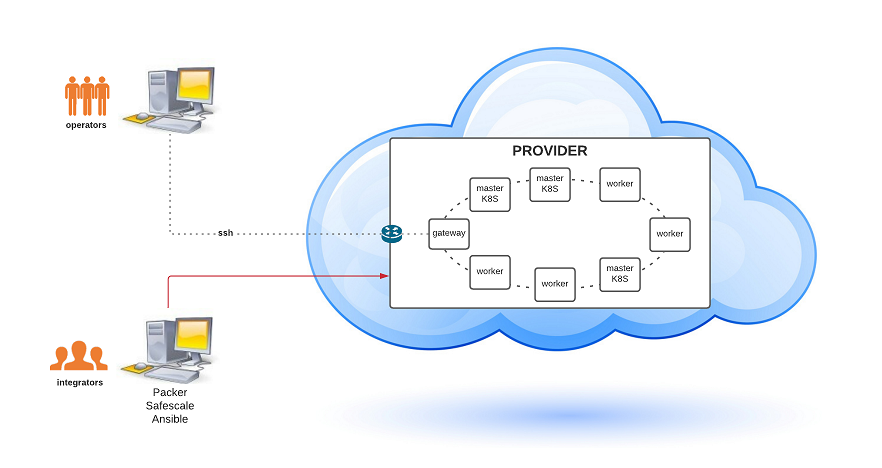

:arrow_heading_up: Go back to the [Reference System Sotfware repository](https://github.com/COPRS/reference-system-software) :arrow_heading_up:

# Installation manual

## Overview



> **Integrators' machine is called BASTION in the rest of the installation manual**

## _Bastion_ requirements

- Safescale: **>= v22.06.0** (https://github.com/CS-SI/SafeScale)
- openstacksdk: **>= v0.12.0** (https://pypi.org/project/openstacksdk/)
- qemu-system: **>= v4.2.1** (https://packages.ubuntu.com/focal/qemu-kvm / https://packages.ubuntu.com/focal/qemu-system-x86)
- Packer: **>= v1.7.8** (https://github.com/hashicorp/packer)
- python3
- python3-pip
- git
- jq
- cloud-image-utils

## Infrastructure requirements

- Default configuration : [here](./user_manuals/config.md)
- A **domain name** publicly available with a wildcard **A** record.  

## Dependencies

### Kubespray
This project exploits Kubespray to deploy Kubernetes.  
The fully detailed documentation and configuration options are available on its page: [https://kubespray.io/](https://kubespray.io/)

### HashiCorp Vault (optional)
This project can integrate credentials from a custom `HashiCorp Vault` instance, see the specific documentation [here](doc/how-to/Credentials.md).

## Quickstart

1. ### Get the infrastructure repository
```shellsession
git clone https://github.com/COPRS/infrastructure.git
```

2. ### Install requirements
```shellsession
cd infrastructure

git submodule update --init

python3 -m pip install --user \
  pyOpenSSL ecdsa \
  -r collections/kubespray/requirements.txt

ansible-galaxy collection install \
    kubernetes.core \
    openstack.cloud
```

3. ### Copy the sample inventory
```shellsession
cp -rfp inventory/sample inventory/mycluster
```

4. ### Review and change the default configuration to match your needs

 - Node groups and S3 buckets in `inventory/mycluster/host_vars_setup/safescale.yaml`
 - Credentials, domain name, the stash license, S3 endpoints in `infrastructure/inventory/mycluster/host_vars/setup/main.yaml`
 - Packages paths containing the apps to be deployed in `inventory/mycluster/host_vars/setup/app_installer.yaml`

5. ### Generate or download the inventory variables
```shellsession
ansible-playbook generate_inventory.yaml \
    -i inventory/mycluster/hosts.yaml
```

6. ### If needed create an image for the machines with `packer`
```shellsession
ansible-playbook image.yaml \
    -i inventory/mycluster/hosts.yaml
```

7. ### Create and configure machines
```shellsession
ansible-playbook cluster.yaml \
    -i inventory/mycluster/hosts.yaml
```

8. ### Install security services
```shellsession
ansible-playbook security.yaml \
    -i inventory/mycluster/hosts.yaml \
    --become
```

9. ### Deploy kubernetes with `kubespray`

```shellsession
# The option `--become` is required, for example writing SSL keys in /etc/,
# installing packages and interacting with various systemd daemons.
# Without --become the playbook will fail to run!

ansible-playbook collections/kubespray/cluster.yml \
    -i inventory/mycluster/hosts.yaml \
    --become
```

10. ### Enable pod security policies (PSP) on the cluster
```shellsession
# /!\ create first the PSP and ClusterRoleBinding resources
# before enabling the admission plugin

ansible-playbook collections/kubespray/upgrade-cluster.yml \
    -i inventory/mycluster/hosts.yaml \
    --tags cluster-roles \
    -e podsecuritypolicy_enabled=true \
    --become

ansible-playbook collections/kubespray/upgrade-cluster.yml \
    -i inventory/mycluster/hosts.yaml \
    --tags master \
    -e podsecuritypolicy_enabled=true \
    --become
```

11. ### Add the providerID spec to the nodes for the autoscaling
```shellsession
ansible-playbook cluster.yaml -i inventory/mycluster/hosts.yaml -t providerids
```

12. ### Deploy the apps 
```shellsession
ansible-playbook apps.yaml \
    -i inventory/mycluster/hosts.yaml
```

## Post installation

- User's Manual : [here](./doc/user_manual.md)
- *NOT MANDATORY* : A **load balancer** listening on the public IP address pointed to by the domain name.  
  Configure the load balancer to forward incoming flow toward the cluster masters.

  | Load balancer port | masters port | protocol |
  | :---: | :---: | :--: |
  | 80 | 32080 | TCP |
  | 443 | 32443 | TCP |

> For **health check** : https://node-ip:6443/readyz <br>
> `node-ip` : private ip of each master

- You may disable access to Keycloak master realm. From Apisix interface: open Route tab, search for `iam_keycloak_keycloak-superadmin` and click on `Offline`.

## Tree view

The repository is made of the following main directories and files.

- **apps**: A package example, gathering default applications deployed with Reference System platform.
- **collections/kubespray**: folder where kubespray is integrated into the project as a git submodule.
    - `cluster.yml`: The Ansible playbook to run to deploy Kubernetes or to add a master node.
    - `scale.yml`: An Ansible playbook to add a worker node.
    - `remove-node.yml`: An Ansible playbook to remove a node.
- **doc**: Here we find all the documentation describing the infrastructure deployment and maintenance operations.
- **inventory**:
  - **sample**: An Ansible inventory for a sample configuration.
      - **group_vars**:
          - **all**:
            - `app_installer.yaml`: The configuration of the app installer roles. It includes the list and paths of packages to install.
            - `main.yaml`: Mandatory platform configuration.
            - `kubespray.yaml`: The Kubespray configuration.
            - `safescale.yaml`: Configuration of the machines, networks and buckets created by SafeScale, and more.
            - **apps**: One file per app deployed containing specific variables.
      - `hosts.yaml`: The list of machines described in their respective groups, this file is managed by the `cluster.yaml` playbook.
- **roles**: The list of roles used to deploy the cluster.
- `ansible.cfg`: Ansible configuration file. It includes the ssh configuration to allow Ansible to access the machines through the gateway.
- `apps.yaml`: An Ansible playbook to deploy the applications on the platform.
- `cluster.yaml`: An Ansible playbook to manage the safescale cluster and its machines
- `delete.yaml`: An Ansible playbook to delete a SafeScale cluster and remove all the generated resources.
- `generate_inventory.yaml`: An Ansible playbook to generate inventory vars.
- `image.yaml`: An Ansible playbook to build a golden OS image.
- `security.yaml`: An Ansible playbook to install the security services on the nodes.

### Playbooks manual

| name | tags | utility | 
|---|---|---|
| apps.yaml | *none* |  *deploy applications*<br>Supported possible options:<br>**-e app=APP_NAME** Deploy only a specific application.<br>**-e debug=true** Keep the application resources generated for debugging.<br>**-e package=PACKAGE_NAME** Deploy only a specific package.|
| cluster.yaml | *none*  <br> create_cluster <br> config <br> gateway <br> update_hosts <br> providerids <br> | *all tags below are executed* <br> create safescale cluster <br> configure cluster machines <br> configure gateways <br> update hosts.yaml with newly created machines, fill .ssh folder with machines ssh private keys <br> write providerID spec to kube nodes |
| delete.yaml <br> :warning: this playbook has been developed with the only purpose of testing the project **not for production usage**| *none* <br> cleanup_generated <br> detach_volumes <br> delete_volumes <br> delete_cluster | *nothing* <br> **remove** ssh keys, added hosts in hosts.yaml, ssh config file <br> detach added disks from k8s nodes <br> delete added disks from k8s nodes <br> delete safescale cluster|
| generate_inventory.yaml | *none* | *Generate/download/upload inventory vars in group_vars/all* |
| image.yaml | *none* | *make reference system golden image for k8s nodes* |
| security.yaml | *none* <br> auditd <br> wazuh <br> clamav <br> openvpn <br> suricata <br> uninstall_APP_NAME| *install all security tools* <br> install auditd <br> install wazuh <br> install clamav <br> install openvpn <br> install suricata <br> uninstall the app matching APP_NAME |

## Apps

Default configurations:

- **Cert manager**
  - Helm chart:
    - Repository: charts.jetstack.io
    - Version: v1.6.1
    - Source: https://github.com/cert-manager/cert-manager/blob/master/deploy/charts/cert-manager
  - Images:
    - quay.io/jetstack/cert-manager-cainjector:v1.6.1
- **Linkerd CNI**
  - Helm chart:
    - Repository: helm.linkerd.io/stable
    - Version: 2.11.1
    - Source: https://github.com/linkerd/linkerd2/tree/main/charts/linkerd2-cni
  - Images:
    - cr.l5d.io/linkerd/cni-plugin:stable-2.11.1
- **Linkerd**
  - Helm chart:
    - Repository: helm.linkerd.io/stable
    - Version: 2.11.1
    - Source: https://github.com/linkerd/linkerd2/tree/main/charts/linkerd-control-plane
  - Images:
    - cr.l5d.io/linkerd/policy-controller:stable-2.11.1
    - cr.l5d.io/linkerd/proxy:stable-2.11.1
    - cr.l5d.io/linkerd/controller:stable-2.11.1
    - cr.l5d.io/linkerd/debug:stable-2.11.1
- **Linkerd Viz**
  - Helm chart:
    - Repository: helm.linkerd.io/stable
    - Version: 2.11.1
    - Source: https://github.com/linkerd/linkerd2/tree/main/viz/charts/linkerd-viz
  - Images:
    - cr.l5d.io/linkerd:stable-2.11.1
- **Rook Ceph** 
  - Helm chart: 
    - Repository: charts.rook.io/release
    - Version: v1.9.4
    - Source: https://github.com/rook/rook/tree/master/deploy/charts/rook-ceph
  - Images:
    - quay.io/cephcsi/cephcsi:v3.6.1
    - k8s.gcr.io/sig-storage/csi-node-driver-registrar:v2.5.0
    - k8s.gcr.io/sig-storage/csi-resizer:v1.4.0
    - k8s.gcr.io/sig-storage/csi-provisioner:v3.1.0
    - k8s.gcr.io/sig-storage/csi-snapshotter:v5.0.1
    - k8s.gcr.io/sig-storage/csi-attacher:v3.4.0
    - quay.io/csiaddons/volumereplication-operator:v0.3.0
- **Rook Ceph Cluster**
  - Helm chart:
    - Repository: charts.rook.io/release
    - Version: v1.7.7
    - Source: https://github.com/rook/rook/tree/master/deploy/charts/rook-ceph-cluster
  - Images:
    - quay.io/ceph/ceph:v16.2.6
- **ECK Operator**
  - Helm chart:
    - Repository: helm.elastic.co
    - Version: 1.9.0
    - Source: https://github.com/elastic/cloud-on-k8s/tree/master/deploy/eck-operator
  - Images:
    - docker.elastic.co/eck/eck-operator:1.9.0
    - docker.elastic.co/elasticsearch/elasticsearch:7.15.2
    - docker.elastic.co/kibana/kibana:7.15.2
    - quay.io/prometheuscommunity/elasticsearch-exporter:v1.3.0
- **Grafana Operator**
  - Helm chart: *None*
  - Images:
    - quay.io/grafana-operator/grafana-operator:v4.2.0
    - docker.io/grafana/grafana:8.3.3-ubuntu
- **Kafka Operator**
  - Helm chart:
    - Repository: strimzi.io/charts/
    - Version: 0.27.1
    - Source: https://github.com/strimzi/strimzi-kafka-operator/tree/main/helm-charts/helm3/strimzi-kafka-operator
  - Images:
    - quay.io/strimzi/operator:0.27.1
    - quay.io/strimzi/kafka:0.27.1-kafka-2.8.1
- **Prometheus Operator**
  - Helm chart:
    - Repository: prometheus-community.github.io/helm-charts
    - Version: 21.0.0
    - Source: https://github.com/prometheus-community/helm-charts/tree/main/charts/kube-prometheus-stack
  - Images:
    - quay.io/prometheus-operator/prometheus-operator:v0.52.1-amd64
    - quay.io/prometheus-operator/prometheus-config-reloader:v0.52.1-amd64
    - quay.io/prometheus/node-exporter:v1.3.0
    - quay.io/prometheus/alertmanager:v0.23.0
    - quay.io/prometheus/prometheus:v2.31.1
- **Stash Operator**
  - Helm chart:
    - Repository: charts.appscode.com/stable
    - Version: v0.17.0
    - Source: https://github.com/stashed/installer/tree/master/charts/stash-community
  - Images:
    - docker.io/appscode/stash:v0.17.0
- **Fluent-bit**
  - Helm chart:
    - Repository: fluent.github.io/helm-charts
    - Version: 0.19.6
    - Source: https://github.com/fluent/helm-charts/tree/main/charts/fluent-bit
  - Images:
    - docker.io/fluent/fluent-bit:1.9.3
- **MongoDB**
  - Helm chart:
    - Repository: charts.bitnami.com/bitnami
    - Version: 11.0.3
    - Source: https://github.com/bitnami/charts/tree/master/bitnami/mongodb
  - Images:
    - docker.io/bitnami/mongodb:5.0.6-debian-10-r14
    - docker.io/bitnami/mongodb-exporter:0.30.0-debian-10-r58
- **OpenLDAP**
  - Helm chart: *None*
  - Images:
    - docker.io/osixia/openldap:1.5.0
- **PostreSQL**
  - Helm chart:
    - Repository: charts.bitnami.com/bitnami
    - Version: 11.0.2
    - Source: https://github.com/bitnami/charts/tree/master/bitnami/postgresql
  - Images:
    - docker.io/bitnami/postgresql:14.1.0-debian-10-r80
    - quay.io/prometheuscommunity/postgres-exporter:v0.10.0
- **Thanos**
  - Helm chart:
    - Repository: charts.bitnami.com/bitnami
    - Version: 8.1.2
    - Source: https://github.com/bitnami/charts/tree/master/bitnami/thanos
  - Images:
    - docker.io/bitnami/thanos:0.23.1-scratch-r3
- **Fluentd**
  - Helm chart:
    - Repository: charts.bitnami.com/bitnami
    - Version: 4.4.1
    - Source: https://github.com/bitnami/charts/tree/master/bitnami/fluentd
  - Images:
    - docker.io/bitnami/fluentd:1.14.2-debian-10-r23
- **Loki**
  - Helm chart:
    - Repository: grafana.github.io/helm-charts
    - Version: 0.48.1
    - Source: https://github.com/grafana/helm-charts/tree/main/charts/loki-distributed
  - Images:
    - docker.io/grafana/loki:2.5.0
- **Apisix**
  - Helm chart:
    - Repository: charts.apiseven.com
    - Version: 0.9.3
    - Source: https://github.com/apache/apisix-helm-chart/tree/master/charts/apisix
  - Images:
    - docker.io/apache/apisix:2.10.0-alpine
    - docker.io/apache/apisix-dashboard:2.10.1-alpine
    - docker.io/apache/apisix-ingress-controller:1.4.1
    - docker.io/bitnami/etcd:3.4.16-debian-10-r14
- **Falco**
  - Helm chart:
    - Repository: falcosecurity.github.io/charts
    - Version: 1.16.2
    - Source: https://github.com/falcosecurity/charts/tree/master/falco
  - Images:
    - docker.io/falcosecurity/falco:0.30.0
    - docker.io/falcosecurity/falco-exporter:0.6.0
- **FinOps object storage exporter**
  - Helm chart:
    - Repository: artifactory.coprs.esa-copernicus.eu/artifactory/rs-helm
    - Version: 1.0.0
    - Source: *Private*
  - Images:
    - artifactory.coprs.esa-copernicus.eu/cs-docker/finops-object-storage-exporter:release-0.3.0
- **FinOps resources exporter**
  - Helm chart:
    - Repository: artifactory.coprs.esa-copernicus.eu/artifactory/rs-helm
    - Version: 1.0.0
    - Source: *Private*
  - Images:
    - artifactory.coprs.esa-copernicus.eu/cs-docker/finops-resources-exporter:release-0.3.0
- **Graylog**
  - Helm chart:
    - Repository: charts.kong-z.com
    - Version: 1.9.2
    - Source: https://github.com/KongZ/charts/tree/main/charts/graylog
  - Images:
    - docker.io/graylog/graylog:4.3.0-rc.1-1
- **Keycloack**
  - Helm chart:
    - Repository: codecentric.github.io/helm-charts
    - Version: 16.0.5
    - Source: https://github.com/codecentric/helm-charts/tree/master/charts/keycloak
  - Images:
    - docker.io/jboss/keycloak:15.0.2
- **Spring Cloud Data Flow**
  - Helm chart:
    - Repository: charts.bitnami.com/bitnami
    - Version: 7.0.1
    - Source: https://github.com/bitnami/charts/tree/master/bitnami/spring-cloud-dataflow
  - Images:
    - docker.io/bitnami/spring-cloud-dataflow:2.9.4-debian-10-r7
    - docker.io/bitnami/spring-cloud-skipper:2.8.4-debian-10-r6
    - docker.io/bitnami/prometheus-rsocket-proxy:1.3.0-debian-10-r334
- **Keda**
  - Helm chart:
    - Repository: kedacore.github.io/charts
    - Version: 2.6.2
    - Source: https://github.com/kedacore/charts/tree/main/keda
  - Images:
    - ghcr.io/kedacore/keda:2.6.1
    - ghcr.io/kedacore/keda-metrics-apiserver:2.6.1
- **Prometheus blackbox exporter**
  - Helm chart:
    - Repository: https://prometheus-community.github.io/helm-charts
    - Version: 5.8.2
    - Source: https://github.com/prometheus-community/helm-charts/tree/main/charts/prometheus-blackbox-exporter
  - Images:
    - docker.io/prom/blackbox-exporter:v0.20.0
- **Autoscaling**
  - Images:
    - artifactory.coprs.esa-copernicus.eu/rs-docker/safescaled:0.8.0-rc1
    - artifactory.coprs.esa-copernicus.eu/rs-docker/cluster-autoscaler:v1.25.0
    - artifactory.coprs.esa-copernicus.eu/rs-docker/rs-infra-scaler:0.8.0-rc2
