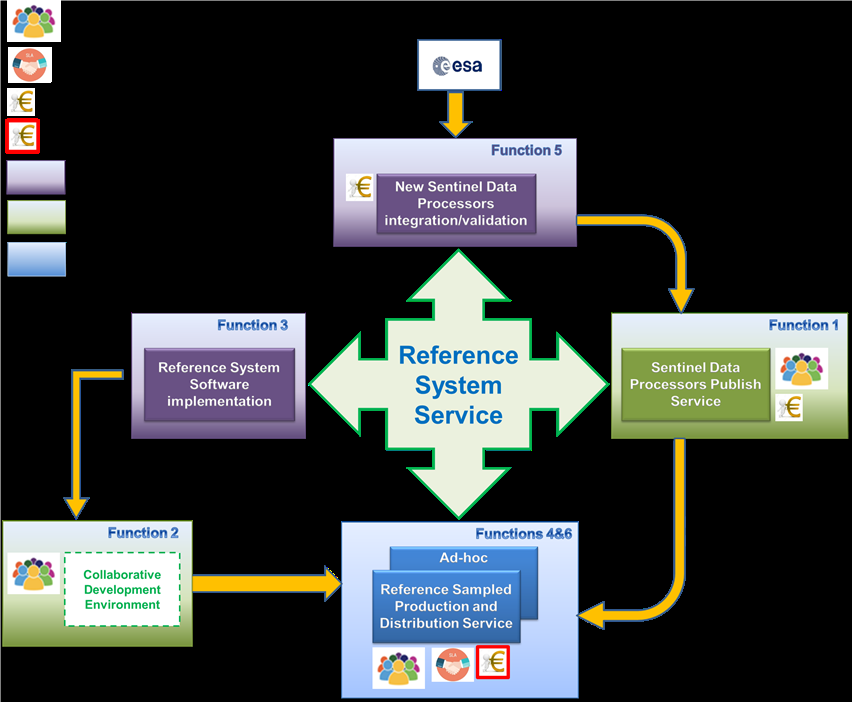
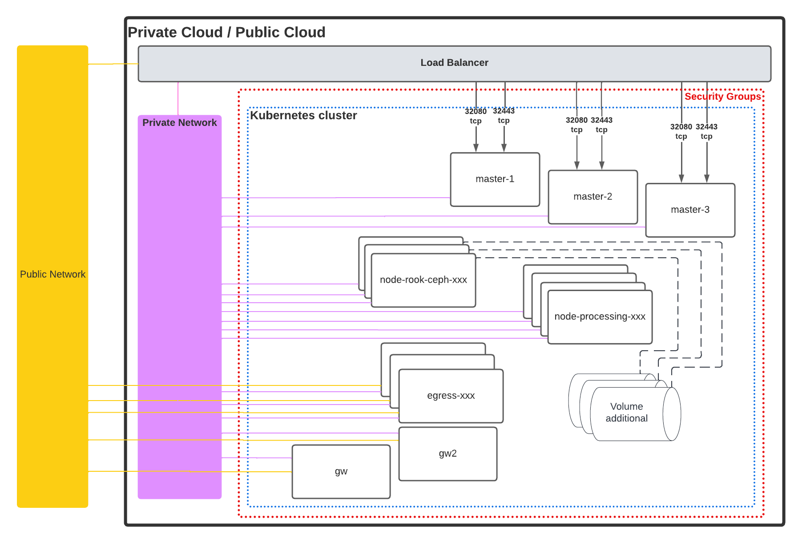
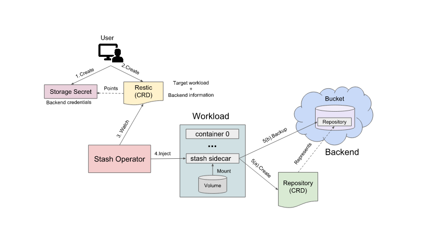
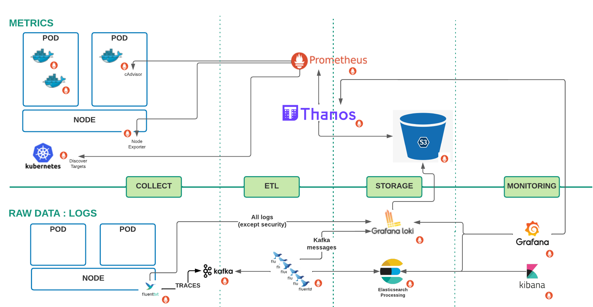
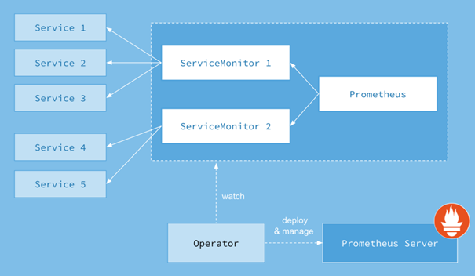

### Copernicus Reference System
# Infrastructure - Architecture Design Document
### Reference System version V2.0
---
## Document Summary

This document is the Architecture Document Design for Infrastructure of Reference System. This document will be completed all along the software development lifecycle

## Document Change log

| Issue/Revision | Date | Change Requests | Observations |
| :------------: | :--: | --------------- | ------------ |
| 1 | 01 Mar 2022 | | v1.0.0   First issue of document |
| 2 | 16 Sep 2022 | | v1.1.0 |

## Table Of Contents

- [Infrastructure - Architecture Design Document](#infrastructure---architecture-design-document)
  - [Document properties](#document-properties)
  - [Document Summary](#document-summary)
  - [Document Change log](#document-change-log)
  - [Table Of Contents](#table-of-contents)
  - [Introduction](#introduction)
    - [Scope](#scope)
    - [Applicable and Reference Documents](#applicable-and-reference-documents)
      - [Applicable documents](#applicable-documents)
      - [Reference documents](#reference-documents)
    - [Glossary](#glossary)
  - [Software overview](#software-overview)
    - [Cloud native architecture](#cloud-native-architecture)
    - [Workflows as the core building primitive](#workflows-as-the-core-building-primitive)
    - [Open Source and collaborative mindset](#open-source-and-collaborative-mindset)
    - [High-level of security](#high-level-of-security)
  - [Components design](#components-design)
  - [Fundation and Main Support Services](#fundation-and-main-support-services)
    - [Kubernetes](#kubernetes)
      - [Kubernetes components](#kubernetes-components)
        - [Master components](#master-components)
          - [kube-apiserver](#kube-apiserver)
          - [etcd](#etcd)
          - [kube-scheduler](#kube-scheduler)
          - [kube-controller-manager](#kube-controller-manager)
          - [cloud-controller-manager](#cloud-controller-manager)
        - [Node components](#node-components)
          - [kubelet](#kubelet)
          - [kube-proxy](#kube-proxy)
      - [Some concepts of Kubernetes](#some-concepts-of-kubernetes)
        - [POD](#pod)
        - [Service](#service)
          - [Motivation](#motivation)
          - [Service resources](#service-resources)
          - [Headless Services](#headless-services)
          - [Publishing Services (ServiceTypes)](#publishing-services-servicetypes)
        - [Namespace](#namespace)
        - [Persistent Volumes](#persistent-volumes)
        - [ConfigMap](#configmap)
        - [Secret](#secret)
        - [CronJob](#cronjob)
      - [HA Mode](#ha-mode)
        - [etcd](#etcd-1)
        - [kube-apiserver](#kube-apiserver-1)
      - [Autoscaling](#autoscaling)
        - [Horizontal Pod Scalling](#horizontal-pod-scalling)
        - [Horizontal Node Scalling](#horizontal-node-scalling)
      - [File System Distributed : Ceph](#file-system-distributed--ceph)
        - [Overview](#overview)
        - [Design](#design)
        - [Integration](#integration)
      - [Container Runtime Interface and Container Runtime](#container-runtime-interface-and-container-runtime)
        - [Container Runtime Interface](#container-runtime-interface)
        - [Container Runtime](#container-runtime)
      - [Domain Name Service](#domain-name-service)
    - [Gateways](#gateways)
    - [Security](#security)
    - [Backup \& Restore](#backup--restore)
      - [Backup](#backup)
      - [Restore](#restore)
  - [Backend services](#backend-services)
    - [Elasticsearch](#elasticsearch)
    - [MongoDB](#mongodb)
    - [PostgreSQL](#postgresql)
    - [Kafka](#kafka)
      - [Overview](#overview-1)
      - [Zookeeper](#zookeeper)
        - [What](#what)
        - [How](#how)
        - [Why](#why)
          - [Controller election](#controller-election)
          - [Configuration Of Topics](#configuration-of-topics)
          - [Access control lists](#access-control-lists)
          - [Membership of the cluster](#membership-of-the-cluster)
  - [Monitoring services](#monitoring-services)
    - [Metrics Data](#metrics-data)
      - [Prometheus](#prometheus)
      - [Thanos](#thanos)
      - [Prometheus Exporters](#prometheus-exporters)
        - [Generic prometheus exporters](#generic-prometheus-exporters)
        - [Specific Prometheus Exporters](#specific-prometheus-exporters)
    - [Logs](#logs)
    - [Logs gathering](#logs-gathering)
      - [Overview](#overview-2)
      - [Configuration](#configuration)
    - [Monitoring](#monitoring)
  - [Processing services](#processing-services)
    - [Overview](#overview-3)
      - [SCDF Server](#scdf-server)
      - [Spring Cloud Skipper](#spring-cloud-skipper)
    - [Stream](#stream)
      - [Spring Cloud Stream](#spring-cloud-stream)
      - [Data Flow Architecture](#data-flow-architecture)
    - [Task](#task)
      - [Spring Cloud Task](#spring-cloud-task)
      - [Data Flow Architecture](#data-flow-architecture-1)
  - [Security services](#security-services)

## Introduction

The Architecture Design Document (ADD) describes the overall architectural design and the detailed design of each component. Internal interfaces design is also included in this document.

This document is inspired by the ECSS Template of the SDD.

It is completed all along the software development lifecycle.

### Scope

The Architecture Design Document is applicable to the Reference System Project.

### Applicable and Reference Documents

#### Applicable documents

| Reference | Issue no | Title of document |
| --------- | :------: | ----------------- |

#### Reference documents

| Acronym | Reference   | Issue no | Title of document |
| :-----: | :---------: | :------: | ----------------- |
| ADD SEC | CSGF-CSC-RS-PRD-ADD-SEC | 2 | Architecture Design Document Security |

### Glossary

| Term | Definition |
| ---- | ---------- |
| ADD | Architecture Design Document |
| CNI | Container Network Interface |
| CRI | Container Runtime Interface |
| DNS | Domain Name Service |
| ECSS | European Cooperation for Space Standardization |
| ETL | Extract Transform and Load |
| HMI | Human Machine Interface |

## Software overview

The Copernicus Reference System Service is the key component of the CSC Ground Segment. It provides an open source and versatile capacity to integrate and validate new Sentinel Data Processors and therefore to improve performances of the system.

Moreover, the service is able to substitute temporarily the nominal Production and Distribution services with a high-demanding level of service.

Finally this service environment brings a new mind-set in the development based on an open source community to reinforce the adoption and attractiveness of Sentinel data.

### Cloud native architecture

The system is based on a full Cloud native system so the solution can meet Copernicus unpredictable user scenarios while optimizing costs. Sentinel-1 PDGS returns of experience is fully integrated in the design of the service.

Furthermore, the Reference System interfaces directly with a cloud orchestrator. Services are launched, duplicated and terminated in synergy with the underlying Cloud infrastructure so the complete system adapts quickly to the current system load or spontaneous failures.

This strategy prevents from procuring a dedicated infrastructure and is in line with the global transformation of IT services relying on the maturity reached by Cloud Service Providers. Public clouds are naturally opened on the Internet and therefore well fitted for services with a public access.

In addition, building a cloud agnostic solution allows to take advantage of the fair competition between Cloud Service Providers and to be freed from the cloud provider’s own priorities and strategies.

### Workflows as the core building primitive

Workflows allow breaking down complex problems into smaller, reusable pieces. With this simple definition, one can argue this technique is already used by the Consortium in previous Copernicus programs, such as Sentinel 1 PDGS: processors do collaborate to produce more and more advanced products as production progresses. Yet, they only exist implicitly in the system as the consequence of the configuration of the communication channels between processors.

In the Reference System requirements, workflows appear as interface elements, which users can browse, instantiate and monitor. The design promotes workflows as a key concept on top of which the rest of the system is built. We integrate Spring Cloud Data Flow, a cloud-native programming and operating model for composable data micro services, to develop our system as a collection of workflows, each orchestrating business specific micro services.

Since this concept is built into the orchestrator, the system exposes excellent progress information and error handling mechanisms out of the box. No need to reconstruct workflow states by correlating monitoring data from individual micro services. The operation, monitoring and maintenance of the system are therefore made easier. Less operators are required and using a parametric cost model allows to offer the right service for the right costs for the benefits of both the users and the Agency.

### Open Source and collaborative mindset

With the Reference System Service, the Agency goes a step further with the set-up of an open-source community for the Reference System software. This software is the exact complement of the Sentinel Data Processors. It provides all the components to integrate the Sentinel Data Processors, which are driven by the Agency, in processing chains and to distribute the output products. Having an open source software opened to the public allows a better visibility of the Copernicus software and a better chance to meet the scientific and business community expectations.

Moreover, contributors are actively improving the quality of the software by reporting anomalies and in some cases proposing correction and/or evolution for the benefits of all users.

### High-level of security

Building upon the experience of the two last decades, security has become a pillar of ground segments. The consortium gathers a significant experience in integrated security in the different program phases and activities. The consortium organization encourages designer to introduce security at the design stage.

Hence, the security management for the Reference System Service is based on a strategy of response to the major security risks, by integrating defence and preventive mechanism during the design phase (DevSecOps).

The same approach has been adopted with success on the Sentinel-1 Cloud PDGS program, and on other Airbus Ground Segments.

## Components design

The Kubernetes cluster is divided into namespaces. We can distinguish 5 types of namespaces:

- those dedicated to main services,
- those dedicated to backend services,
- those dedicated to monitoring services,
- those dedicated to processing services,
- and those dedicated to security services.

The big picture of what is contained in the cluster is depicted in the figure below.

## Fundation and Main Support Services

The main challenges of this system are :

- Defining a strategy to easily & securely migrate to the cloud
- Providing a PaaS provider-agnostic to automatically create and manage ICT & easily deploy secured micro-services
- Pushing the automation of infrastructure creation, deployment and maintenance tasks in a DevSecOps Spirit

For that, we deploy [Kubernetes](https://github.com/kubernetes/kubernetes). Kubernetes became the standard de facto of large scale micro service orchestration system, as a result a large ecosystem has been built around it. This ecosystem provides numerous additional components to help connecting, securing, managing and monitoring services orchestrated by Kubernetes.

This Architecture is compliant with Scaling services (with security) that enable scale up platform resources without any modification.

### Kubernetes

#### Kubernetes components

> Kubernetes is deployed using Kubespray. You can find more information here:  
> <https://github.com/kubernetes-sigs/kubespray>

When you deploy Kubernetes, you get a cluster.

A cluster is a set of machines, called nodes, that run containerized applications managed by Kubernetes. A cluster has at least one worker node and at least one master node.

The worker node(s) host the pods that are the components of the application. The master node(s) manages the worker nodes and the pods in the cluster. Multiple master nodes are used to provide a cluster with failover and high availability.

This document outlines the various components you need to have a complete and working Kubernetes cluster.

Here’s the diagram of a Kubernetes cluster with all the components tied together.

##### Master components

Master components provide the cluster’s control plane. Master components make global decisions about the cluster (for example, scheduling), and they detect and respond to cluster events (for example, starting up a new pod (cf chapter **Kubernetes Concept**) when a deployment’s replicas field is unsatisfied).

Master components can be run on any machine in the cluster. However, for simplicity, set up scripts typically start all master components on the same machine, and do not run user containers on this machine.

###### kube-apiserver

The API server is a component of the Kubernetes control plane that exposes the Kubernetes API. The API server is the front end for the Kubernetes control plane.

The main implementation of a Kubernetes API server is kube-apiserver. **kube-apiserver** is designed to scale horizontally—that is, it scales by deploying more instances. You can run several instances of **kube-apiserver** and balance traffic between those instances.

###### etcd

Consistent and highly-available key value store used as Kubernetes’ backing store for all cluster data.

If your Kubernetes cluster uses **etcd** as its backing store, make sure you have a back up plan for those data.

###### kube-scheduler

Component on the master that watches newly created pods that have no node assigned, and selects a node for them to run on.

Factors taken into account for scheduling decisions include individual and collective resource requirements, hardware/software/policy constraints, affinity and anti-affinity specifications, data locality, inter-workload interference and deadlines.

###### kube-controller-manager

Component on the master that runs controllers .

Logically, each controller is a separate process, but to reduce complexity, they are all compiled into a single binary and run in a single process.

These controllers include:

- Node Controller: Responsible for noticing and responding when nodes go down.
- Replication Controller: Responsible for maintaining the correct number of pods for every replication controller object in the system.
- Endpoints Controller: Populates the Endpoints object (that is, joins Services & Pods).
- Service Account & Token Controllers: Create default accounts and API access tokens for new namespaces.

###### cloud-controller-manager

**cloud-controller-manager** runs controllers that interact with the underlying cloud providers. The cloud-controller-manager binary is an alpha feature introduced in Kubernetes release 1.6.

cloud-controller-manager runs cloud-provider-specific controller loops only. You must disable these controller loops in the kube-controller-manager. You can disable the controller loops by setting the --cloud-provider flag to external when starting the kube-controller-manager.

cloud-controller-manager allows the cloud vendor’s code and the Kubernetes code to evolve independently of each other. In prior releases, the core Kubernetes code was dependent upon cloud-provider-specific code for functionality. In future releases, code specific to cloud vendors should be maintained by the cloud vendor themselves, and linked to cloud-controller-manager while running Kubernetes.

The following controllers have cloud provider dependencies:

- Node Controller: For checking the cloud provider to determine if a node has been deleted in the cloud after it stops responding
- Route Controller: For setting up routes in the underlying cloud infrastructure
- Service Controller: For creating, updating and deleting cloud provider load balancers
- Volume Controller: For creating, attaching, and mounting volumes, and interacting with the cloud provider to orchestrate volumes

##### Node components

Node components run on every node, maintaining running pods and providing the Kubernetes runtime environment.

###### kubelet

An agent that runs on each node in the cluster. It makes sure that containers are running in a pod.

The **kubelet** takes a set of PodSpecs that are provided through various mechanisms and ensures that the containers described in those PodSpecs are running and healthy. The kubelet doesn’t manage containers which were not created by Kubernetes.

###### kube-proxy

**kube-proxy** is a network proxy that runs on each node in your cluster, implementing part of the Kubernetes Service concept (cf chapter **Kubernetes Concept**) .

kube-proxy maintains network rules on nodes. These network rules allow network communication to your Pods from network sessions inside or outside of your cluster.

kube-proxy uses the operating system packet filtering layer if there is one and it’s available. Otherwise, kube-proxy forwards the traffic itself.

#### Some concepts of Kubernetes

> A **Job** creates one or more Pods and ensures that a specified number of them successfully terminate. As pods successfully complete, the Job tracks the successful completions. When a specified number of successful completions is reached, the task (ie, Job) is complete. Deleting a Job will clean up the Pods it created.
>
>A simple case is to create one Job object in order to reliably run one Pod to completion. The Job object will start a new Pod if the first Pod fails or is deleted (for example due to a node hardware failure or a node reboot).
>
>You can also use a Job to run multiple Pods in parallel.

##### POD

A **POD** (as in a pod of whales or pea pod) is a group of one or more containers (such as Docker containers), with shared storage/network, and a specification for how to run the containers. A Pod’s contents are always co-located and co-scheduled, and run in a shared context. A Pod models an application-specific “logical host” - it contains one or more application containers which are relatively tightly coupled — in a pre-container world, being executed on the same physical or virtual machine would mean being executed on the same logical host.

While Kubernetes supports more container runtimes than just Docker, Docker is the most commonly known runtime, and it helps to describe Pods in Docker terms.

The shared context of a Pod is a set of Linux namespaces, cgroups, and potentially other facets of isolation - the same things that isolate a Docker container. Within a Pod’s context, the individual applications may have further sub-isolations applied.

Containers within a Pod share an IP address and port space, and can find each other via localhost. They can also communicate with each other using standard inter-process communications like SystemV semaphores or POSIX shared memory. Containers in different Pods have distinct IP addresses and can not communicate by IPC without special configuration. These containers usually communicate with each other via Pod IP addresses.

Applications within a Pod also have access to shared volumes , which are defined as part of a Pod and are made available to be mounted into each application’s filesystem.

In terms of Docker constructs, a Pod is modelled as a group of Docker containers with shared namespaces and shared filesystem volumes.

Like individual application containers, Pods are considered to be relatively ephemeral (rather than durable) entities. As discussed in pod lifecycle, Pods are created, assigned a unique ID (UID), and scheduled to nodes where they remain until termination (according to restart policy) or deletion. If a Node dies, the Pods scheduled to that node are scheduled for deletion, after a timeout period. A given Pod (as defined by a UID) is not “rescheduled” to a new node; instead, it can be replaced by an identical Pod, with even the same name if desired, but with a new UID.

When something is said to have the same lifetime as a Pod, such as a volume, that means that it exists as long as that Pod (with that UID) exists. If that Pod is deleted for any reason, even if an identical replacement is created, the related thing (e.g. volume) is also destroyed and created anew.

Source: <https://kubernetes.io/docs/concepts/workloads/pods/pod/>

##### Service

###### Motivation

Kubernetes Pods are mortal. They are born and when they die, they are not resurrected. If you use a Deployment to run your app, it can create and destroy Pods dynamically.

Each Pod gets its own IP address, however in a Deployment, the set of Pods running in one moment in time could be different from the set of Pods running that application a moment later.

This leads to a problem: if some set of Pods (call them “backends”) provides functionality to other Pods (call them “frontends”) inside your cluster, how do the frontends find out and keep track of which IP address to connect to, so that the frontend can use the backend part of the workload?

Enter Services.

###### Service resources

In Kubernetes, a **Service** is an abstraction which defines a logical set of Pods and a policy by which to access them (sometimes this pattern is called a micro-service). The set of Pods targeted by a Service is usually determined by a selector (see below for why you might want a Service without a selector).

For example, consider a stateless image-processing backend which is running with 3 replicas. Those replicas are fungible—frontends do not care which backend they use. While the actual Pods that compose the backend set may change, the frontend clients should not need to be aware of that, nor should they need to keep track of the set of backends themselves.

The Service abstraction enables this decoupling.

**Cloud-native service discovery**

If you’re able to use Kubernetes APIs for service discovery in your application, you can query the API server for Endpoints, that get updated whenever the set of Pods in a Service changes.

For non-native applications, Kubernetes offers ways to place a network port or load balancer in between your application and the backend Pods.

###### Headless Services

Sometimes you don’t need load-balancing and a single Service IP. In this case, you can create what are termed “headless” Services, by explicitly specifying "None" for the cluster IP (.spec.clusterIP).

You can use a headless Service to interface with other service discovery mechanisms, without being tied to Kubernetes’ implementation.

For headless Services, a cluster IP is not allocated, kube-proxy does not handle these Services, and there is no load balancing or proxying done by the platform for them. How DNS is automatically configured depends on whether the Service has selectors defined:

-- With selectors

For headless Services that define selectors, the endpoints controller creates Endpoints records in the API, and modifies the DNS configuration to return records (addresses) that point directly to the Pods backing the Service.

-- Without selectors

For headless Services that do not define selectors, the endpoints controller does not create Endpoints records. However, the DNS system looks for and configures either:

- CNAME records for ExternalName-type Services.
- A records for any Endpoints that share a name with the Service, for all other type

###### Publishing Services (ServiceTypes)

For some parts of your application (for example, frontends) you may want to expose a Service onto an external IP address, that’s outside of your cluster. Kubernetes ServiceTypes allow you to specify what kind of Service you want. The default is **ClusterIP**.

Type values and their behaviors are:

- **ClusterIP**: Exposes the Service on a cluster-internal IP. Choosing this value makes the Service only reachable from within the cluster. This is the default ServiceType.
- **NodePort**: Exposes the Service on each Node’s IP at a static port (the NodePort). A ClusterIP Service, to which the NodePort Service routes, is automatically created. You’ll be able to contact the NodePort Service, from outside the cluster, by requesting `<NodeIP>:<NodePort>`.
- **LoadBalancer**: Exposes the Service externally using a cloud provider’s load balancer. NodePort and ClusterIP Services, to which the external load balancer routes, are automatically created.
- **ExternalName**: Maps the Service to the contents of the ExternalName field (e.g. foo.bar.example.com), by returning a CNAME record with its value. No proxying of any kind is set up.

Source: <https://kubernetes.io/docs/concepts/services-networking/service/>

##### Namespace

Kubernetes supports multiple virtual clusters backed by the same physical cluster. These virtual clusters are called **namespaces**.

Namespaces are intended for use in environments with many users spread across multiple teams, or projects. For clusters with a few to tens of users, you should not need to create or think about namespaces at all. Start using namespaces when you need the features they provide.

Namespaces provide a scope for names. Names of resources need to be unique within a namespace, but not across namespaces. Namespaces can not be nested inside one another and each Kubernetes resource can only be in one namespace.

Namespaces are a way to divide cluster resources between multiple users (via resource quota).

In future versions of Kubernetes, objects in the same namespace will have the same access control policies by default.

It is not necessary to use multiple namespaces just to separate slightly different resources, such as different versions of the same software: use labels to distinguish resources within the same namespace.

Source: <https://kubernetes.io/docs/concepts/overview/working-with-objects/namespaces/>

##### Persistent Volumes

Managing storage is a distinct problem from managing compute instances. The PersistentVolume subsystem provides an API for users and administrators that abstracts details of how storage is provided from how it is consumed. To do this, we introduce two new API resources: PersistentVolume and PersistentVolumeClaim.

A PersistentVolume (PV) is a piece of storage in the cluster that has been provisioned by an administrator or dynamically provisioned using Storage Classes. It is a resource in the cluster just like a node is a cluster resource. PVs are volume plugins like Volumes, but have a lifecycle independent of any individual Pod that uses the PV. This API object captures the details of the implementation of the storage, be that NFS, iSCSI, or a cloud-provider-specific storage system.

A PersistentVolumeClaim (PVC) is a request for storage by a user. It is similar to a Pod. Pods consume node resources and PVCs consume PV resources. Pods can request specific levels of resources (CPU and Memory). Claims can request specific size and access modes (e.g., they can be mounted once read/write or many times read-only).

While PersistentVolumeClaims allow a user to consume abstract storage resources, it is common that users need PersistentVolumes with varying properties, such as performance, for different problems. Cluster administrators need to be able to offer a variety of PersistentVolumes that differ in more ways than just size and access modes, without exposing users to the details of how those volumes are implemented. For these needs, there is the StorageClass resource.

Source: <https://kubernetes.io/docs/concepts/storage/persistent-volumes/>

##### ConfigMap

**ConfigMaps** bind configuration files, command-line arguments, environment variables, port numbers, and other configuration artifacts to your Pods' containers and system components at runtime. ConfigMaps allow you to separate your configurations from your Pods and components, which helps keep your workloads portable, makes their configurations easier to change and manage, and prevents hardcoding configuration data to Pod specifications.

ConfigMaps are useful for storing and sharing non-sensitive, unencrypted configuration information. To use sensitive information in your clusters, you must use Secrets.

##### Secret

**Secrets** are secure objects which store sensitive data, such as passwords, OAuth tokens, and SSH keys, in your clusters. Storing sensitive data in Secrets is more secure than plaintext .ConfigMaps or in Pod specifications. Using Secrets gives you control over how sensitive data is used, and reduces the risk of exposing the data to unauthorized users.

##### CronJob

**CronJobs** use to run tasks at a specific time or interval. CronJobs are a good choice for automatic tasks, such as backups, reporting, sending emails, or cleanup tasks.

CronJobs use **Job** objects to complete their tasks. A CronJob creates a Job object each time it runs. CronJobs are created, managed, scaled, and deleted in the same way as Jobs.

#### HA Mode

The following components require a highly available endpoints:

- etcd cluster,
- kube-apiserver service instances.
The latter relies on a 3rd side reverse proxy, like Nginx or HAProxy, to achieve the same goal.

##### etcd

The etcd clients (kube-api-masters) are configured with the list of all etcd peers. If the etcd-cluster has multiple instances, it's configured in HA already.

##### kube-apiserver

K8s components require a loadbalancer to access the apiservers via a reverse proxy. Kubespray includes support for an nginx-based proxy that resides on each non-master Kubernetes node. This is referred to as localhost loadbalancing. It is less efficient than a dedicated load balancer because it creates extra health checks on the Kubernetes apiserver, but is more practical for scenarios where an external LB or virtual IP management is inconvenient. This option is configured by the variable loadbalancer_apiserver_localhost (defaults to True. Or False, if there is an external loadbalancer_apiserver defined). You may also define the port the local internal loadbalancer uses by changing, loadbalancer_apiserver_port. This defaults to the value of kube_apiserver_port. It is also important to note that Kubespray will only configure kubelet and kube-proxy on non-master nodes to use the local internal loadbalancer.

If you choose to NOT use the local internal loadbalancer, you will need to configure your own loadbalancer to achieve HA. Note that deploying a loadbalancer is up to a user and is not covered by ansible roles in Kubespray. By default, it only configures a non-HA endpoint, which points to the access_ip or IP address of the first server node in the kube_control_plane group. It can also configure clients to use endpoints for a given loadbalancer type. The following diagram shows how traffic to the apiserver is directed.

Source: <https://github.com/kubernetes-sigs/kubespray/blob/master/docs/ha-mode.md>

#### Autoscaling

##### Horizontal Pod Scalling

Out-of-the-box Kubernetes supports autoscaling via the Horizontal Pod Autoscaler (HPA), which automatically adjusts the number of pods in a deployment, replica set or stateful set based on CPU and memory usage. But sometimes this is not enough, especially if you follow event-driven or serverless architecture and are developing cloud-native applications. One of the most common use cases in such systems would be to scale workloads based on the number of messages in a queue/topic rather than CPU or memory. Ultimately, we would want to reduce the topic/queue consumers as the number of messages increases and resize again once the number decreases. Although there is no built-in support for this in Kubernetes, we can achieve this through an open source project called "KEDA".

[KEDA](https://keda.sh/) is a Kubernetes-based Event Driven Autoscaler. With KEDA, you can drive the scaling of any container in Kubernetes based on the number of events needing to be processed.

##### Horizontal Node Scalling

Cf `how-to` [Cluster scaling](../user_manuals/how-to/Cluster%20scaling.md)

#### File System Distributed : Ceph

> You can see a trade-off on this subject here : <https://github.com/COPRS/infrastructure/wiki/Storage-technology-solution-trade-off>

##### Overview

Ceph is an open-source software (software-defined storage) storage platform, implements object storage on a single distributed computer cluster, and provides 3-in-1 interfaces for object-, block- and file-level storage. Ceph aims primarily for completely distributed operation without a single point of failure, scalable to the exabyte level, and freely available. Since version 12 Ceph does not rely on other filesystems and can directly manage HDDs and SSDs with its own storage backend BlueStore and can completely self reliantly expose a POSIX filesystem.

Ceph replicates data and makes it fault-tolerant,[7] using commodity hardware, Ethernet IP and requiring no specific hardware support. The Ceph’s system offers disaster recovery and data redundancy through techniques such as replication, erasure coding, snapshots and storage cloning. As a result of its design, the system is both self-healing and self-managing, aiming to minimize administration time and other costs.

In this way, administrators have a single, consolidated system that avoids silos and collects the storage within a common management framework. Ceph consolidates several storage use cases and improves resource utilization. It also lets an organization deploy servers where needed.

##### Design

Ceph employs five distinct kinds of daemons :

- Cluster monitors (ceph-mon) that keep track of active and failed cluster nodes, cluster configuration, and information about data placement and global cluster state.
- Object storage devices(ceph-osd) that use a direct, journaled disk storage (named BlueStore,[9] which since the v12.x release replaces the FileStore which would use a filesystem)
- Metadata servers (ceph-mds) that cache and broker access to inodes and directories inside a CephFS filesystem.
- HTTP gateways (ceph-rgw) that expose the object storage layer as an interface compatible with Amazon S3 or OpenStack Swift APIs
- Managers (ceph-mgr) that perform cluster monitoring, bookkeeping, and maintenance tasks, and interface to external monitoring systems and management (e.g. balancer, dashboard, Prometheus, Zabbix plugin)

Ceph does striping of individual files across multiple nodes to achieve higher throughput, similar to how RAID0 stripes partitions across multiple hard drives. Adaptive load balancing is supported whereby frequently accessed objects are replicated over more nodes

> More information on Ceph architecture : <https://docs.ceph.com/en/latest/architecture/>

##### Integration

To implement Ceph filesystem in Kubernetes we selected the Rook storage operator. Rook automates the tasks of a storage administrator: deployment, bootstrapping, configuration, provisioning, scaling, upgrading, migration, disaster recovery, monitoring, and resource management. (<https://rook.io/>)

#### Container Runtime Interface and Container Runtime

##### Container Runtime Interface

At the lowest layers of a Kubernetes node is the software that, among other things, starts and stops containers. It call this the **Container Runtime**. The most widely known container runtime is Docker, but it is not alone in this space. In fact, the container runtime space has been rapidly evolving. To make Kubernetes more extensible, it was developed a plugin API for container runtimes in Kubernetes, called **Container Runtime Interface (CRI)**.

Container Runtime Interface is a plugin interface which enables kubelet to use a wide variety of container runtimes, without the need to recompile. CRI consists of a protocol buffers and gRPC API, and libraries, with additional specifications and tools.

##### Container Runtime

Here are some Container Runtime that can be used with Kubernetes :

- containerd
- Docker
- cri-o
- KataContainer
- Gvisor
- ...

We chose **containerd** like Container Runtime Interface because :

- very mature since it comes from Docker itself and it is CNCF graduated
- officially supported by Kubernetes
- default and officially supported by AKS, EKS, GKE, k3s
- present in most Kubernetes cluster installations
- fully supports OCI runtime-spec and OCI image-spec
- support Windows Kubernetes nodes
- follows plugin model

It is also possible to use an alternative better secured *runc* alternative such as [KataContainer](https://katacontainers.io/) and [Gvisor](https://github.com/google/gvisor). KataContainer aims at providing best of Container and Virtualization technologies combining speed and resource isolation. Gvisor is a user-space container runtime that provides an isolation boundary between the application hosted by the container and the host kernel.

> You can see a trade-off on this subject here : <https://github.com/COPRS/infrastructure/wiki/Container-Runtimes-solution-trade-off>

#### Domain Name Service

The DNS services offered by some European Cloud Providers do not offer the level of availability necessary for an operational production environment. Even if some providers are capable to offer a good level of availability this heterogeneity of the service quality creates an implicit adherence to the Cloud Provider. To remove this adherence it is therefore necessary that the platform is autonomous for the Domain Name Service. For this and to ensure a high level of availability, it will be necessary to instantiate 2 DNS services, one primary and one secondary to compensate for a possible failure of the primary. Numerous open source DNS available for Linux distributions exists, bind9, PowerDNS, unbound, Knot and CoreDNS are the more widely adopted.

For our purpose DNS servers that support DNSSEC and that can be used as both an authoritative and recursive name server are necessary. Because unbound is only recursive it is excluded.

As the system infrastructure dynamically evolves according to the processing load it is also very important that authoritative bindings of the DNS servers can be modified and synchronized without restarting, which is not possible with bind9. Knot allows dynamic configuration but it is painful to automatize primary and secondary DNS databases synchronization. To implement authoritative bindings PowerDNS can use standard relational databases such as MySQL and PostgreSQL. By the way configuring the backend in HA mode allows a perfect synchronization of the primary and secondary databases. Nevertheless this implies an extra configuration costs not necessary if using CoreDNS in an environment where Kubernetes is deployed because CoreDNS can use the etcd provided by Kubernetes as backend. Moreover CoreDNS can be used by Kubernetes for service discovery and it is generally very well integrated into Kubernetes ecosystem.

In conclusion CoreDNS seems to be the DNS the more suitable to use. Among the best practices recommended for DNS server configuration, 2 are particularly important:

- Use ACL to control access by external hosts
- Use DNSSEC authentication protocol to prevent classical security issues like DNS cache poisoning

For log management CoreDNS provide a [plugin](https://coredns.io/plugins/log/) to write logs on the standard output and thus make it easy to collect and filter logs using a log aggregator and forward them to central log manager.

In our system, we use **CoreDNS** :

- because CoreDNS is a DNS server use by Kubernetes to resolve service object name.
- Static A record are added in CoreDNS database to resolve Kubernetes nodes FQDN in "cluster.local" domain.
- CoreDNS ConfigMap are updated automatically when a node is added or removed.
- PTR record are not covered.

### Gateways

> This part is described in [ ADD SEC ]

### Security

> This part is described in [ ADD SEC ]

### Backup & Restore

Stash (<https://appscode.com/products/stash/>) aims to backup content of kubernetes persistant volume on a storage backend, on our case an object storage acessed trough restic (<https://restic.net/>).

#### Backup

In order to backup PVs data, we have to create a custom ressource Restic, which will specify what and how to backup.
You have to specify:

- The pod where the PV to backup is mounted (with selector)
- The backend infos, (depends of the object storage kind). Beware, the bucket must already exists as restic suffer issues on bucket creation.
- The path where the PV is mounted inside the container
- The retention policy (how much snapshots we have to keep)
- The backup schedule

It injects a sidecar container into the backuped pod, creates a custom ressource Repository describing the global snapshots informations and custom ressources Snapshots each one representing a backup succesfully uploaded on the object storage.

Notes:

- We recommend that you deploy the backup service at the same time as the deployment of the pod concerned by this backup because otherwise a service interruption of a few minutes will take place because it is an installation in sidecar mode
- On the other hand, there will be no downtime if you change the backup configuration later on (for example: change the frequency of the backup)

#### Restore

To restore a backuped PV you have to create a custom ressource Recovery, which will specify which PV should be restored and with which snapshot.
You have to specify:

- A repository containing the backups.
- The PV where the backup must be applied ( this PV have to be unbounded while being restored).
- The path where the PV will be mounted inside the container.

A pod will be launched, will mount the PV and then will proceed to restore backuped datas.

As a Recovery refers to a Repository, you may have to create a new Repository too.
You have to specify:

- Labels specifying the backuped object.
- The backend infos, (depends of the object storage kind)

## Backend services

### Elasticsearch

See Nodes Roles to understand how the ES nodes work together in the cluster :  
<https://www.elastic.co/guide/en/elasticsearch/reference/current/modules-node.html>

In the system, we have two instances:

- elasticsearch-processing (in namespace *database* )
- elasticsearch-security (in namespace *security* )

### MongoDB

See:  

- <https://docs.mongodb.com/manual/replication/>
- <https://docs.mongodb.com/manual/core/replica-set-arbiter/>

### PostgreSQL

See Streaming Replication:  
<https://www.postgresql.org/docs/14/warm-standby.html>

### Kafka

#### Overview

Apache Kafka is an event-streaming platform that runs as a cluster of nodes called “brokers” and was developed initially as a messaging queue. Today, Kafka can be used to process and store a massive amount of information all while seamlessly allowing applications to publish and consume these messages stored as records within a what is called a topic. Typically Kafka is used to efficiently broker data between systems or to allow applications to react to streams of data in real time. In addition to being a popular message queue for distributed systems, it is commonly used to stream data in IoT use cases.

#### Zookeeper

##### What

Zookeeper is a top-level software developed by Apache that acts as a centralized service and is used to maintain naming and configuration data and to provide flexible and robust synchronization within distributed systems. Zookeeper keeps track of status of the Kafka cluster nodes and it also keeps track of Kafka topics, partitions etc.

Zookeeper it self is allowing multiple clients to perform simultaneous reads and writes and acts as a shared configuration service within the system. The Zookeeper atomic broadcast (ZAB) protocol i s the brains of the whole system, making it possible for Zookeeper to act as an atomic broadcast system and issue orderly updates.

##### How

The data within Zookeeper is divided across multiple collection of nodes and this is how it achieves its high availability and consistency. In case a node fails, Zookeeper can perform instant failover migration; e.g. if a leader node fails, a new one is selected in real-time by polling within an ensemble. A client connecting to the server can query a different node if the first one fails to respond.

##### Why

###### Controller election

The controller is one of the most important broking entity in a Kafka ecosystem, and it also has the responsibility to maintain the leader-follower relationship across all the partitions. If a node by some reason is shutting down, it’s the controller’s responsibility to tell all the replicas to act as partition leaders in order to fulfill the duties of the partition leaders on the node that is about to fail. So, whenever a node shuts down, a new controller can be elected and it can also be made sure that at any given time, there is only one controller and all the follower nodes have agreed on that.

###### Configuration Of Topics

The configuration regarding all the topics including the list of existing topics, the number of partitions for each topic, the location of all the replicas, list of configuration overrides for all topics and which node is the preferred leader, etc.

###### Access control lists

Access control lists or ACLs for all the topics are also maintained within Zookeeper.

###### Membership of the cluster

Zookeeper also maintains a list of all the brokers that are functioning at any given moment and are a part of the cluster.

**Please note** that you can’t run Kafka services without first installing Zookeeper. However, Zookeeper is already installed and configured for your Kafka cluster.

## Monitoring services

This main functional part is a very important one because it allows measuring the system global performance. It's based on the Monitoring Chain which consists of collecting, filtering, storing and analysing various data from the entire system.

All data must always be present and always accessible in system. However, their availability time and frequency of access vary according to the kind of data:

- Metrics data:  no need for resilience / write once / medium frequency
- Logs (except security): no need for resilience / write once / high frequency
- REPORTS: resilient / write once / medium frequency

**The use of databases makes it possible to meet these needs.**

### Metrics Data

In order to monitor the platform (vms, k8s and services) we chose to use metrics. A metric is made of a name, a numeric value, a timestamp and some labels to enrich the context of the metric, an so is a powerful tool to follow the status and evolution of all the components of the platform.

We have to produce, fetch, store and make available these metrics, for this we use a bunch of exporters, Prometheus and Thanos.

#### Prometheus

[Prometheus](https://prometheus.io/) is the central part, fetching all the metrics from the exporters, storing and displaying them.

Our Prometheus is deeply integrated with Kubernetes thanks to the [prometheus-operator](https://github.com/prometheus-operator/prometheus-operator), so a k8s crd names serviceMonitor is available and allow Prometheus to automatically detect and update his configuration to fetch all the metrics linked to a servicemonitor.

So to fetch metrics with Prometheus you have to :

- create a service exposing the metrics
- create a servicemonitor with a selector and a label "release=prometheus-operator" matching the service label

Then all the exporters are listed on Prometheus graphical interface

Once the metrics are pulled, Prometheus will use rules to create new metrics which are aggregations of previous ones

All theses metrics can then be viewed on  Prometheus graphical interface

All the metrics are updated approximately every 30 seconds.

Prometheus is keeping metrics for 2 days

#### Thanos

In the platform some metrics are key information and cannot be lost, so in order to have a highly-available Prometheus and to keep metrics for an extended time we choose to use [Thanos](https://thanos.io/).

It's like a Prometheus overlay built with several blocks:

- The prometheus-sidecar, who give other Thanos components access to the Prometheus metrics.
- The query, who evaluate PromQL queries against all instances at once, and deduplicate metrics.
- The store gateway, who store metrics onto the object storage.
- The compactor, who compacts older data to improve query efficiency.
- The ruler, who generate alerts based on some metrics, and then will push alerts to the alert-manager

Metrics are stored on the object storage after a 30 minutes consolidation. They are kept raw for 1month, then down-sampled to one point for each 5min period for 4months, and finaly down-sampled to one point for each 60min period after 4months.

In order to benefit from Thanos all metrics access have to be done through the thanos query endpoint, a graphical interface is exposed.

The ruler graphical interface is exposed.

#### Prometheus Exporters

Exporters are http servers aiming to monitor something and produce metrics describing the monitored object. They are usualy exposed on **<http://x.x.x.x:2112/metrics>** and are updated on a regular basis.  
They can be independent services or part of the monitored object.

##### Generic prometheus exporters

| **Exporter** | **Number** | **Infos** |
| ------------ | ---------- | --------- |
| Node | One/node | |
| Kubernetes | One | |
| Api server | One/master | |
| Core DNS | Two | |
| Etcd (Kubernetes) | One/master | |
| Kube Controller Manager | One/master | |
| Kube Proxy | One/node | |
| Kube scheduler | One/master | |
| Kubelet | One/node | |
| Kubelet cAdivsor | One/node | |
| Kubelet Probes | One/node | |
| Keda Operator | One/Replica | |
| Keda Metrics API Server | One/Replica | |
| Apisix | One/Replica | |
| Apisix Ingress Controller | One/Replica | |
| Etcd (Apisix) | One/Replica | |
| Linkerd Controller | One/Replica | |
| Linkerd Proxy | One/Pod | Pod configured with Linkerd  |
| Keycloak | One/Replica | |
| OpenLDAP | One | |
| cert-manager | One/Replica | |
| Rook Ceph Operator | One | |
| Kafka Cluster Operator | One | |
| Kafka Entity Operator | One | |
| Kafka | One/Replica | Kafka Cluster Ressources Metrics |
| Zookeeper | One/Replica | Kafka Cluster Ressources Metrics |
| Kafka Exporter | One | Kafka Cluster Ressources Metrics |
| Fluentbit | One/Node | |
| Fluentd | One/Replica | |
| Prometheus Operator | One |
| Prometheus | One/Replica | |
| Prometheus AlertManager | One/Replica | |
| Thanos Compactor | One/Replica | |
| Thanos Query | One/Replica |
| Thanos Store Gateway | One/Replica |
| Elastic Operator | One | |
| Elasticsearch Processing | One | |
| Elasticsearch Security | One | |
| Loki | One | |
| Grafana | One | |
| Grafana Operator | One | |
| Kibana Processing | One | |
| Kibana Security | One | |
| PostgreSQL | TBD | |
| MongoDB | One/Replica | |
| Spring Cloud Data Flow | One | |
| Stash Operator | One | |
| Stash PushGateway | One | |
| Graylog | One/Replica | |
| Falco | One/Node | |

##### Specific Prometheus Exporters

| **Exporter** | **Number** | **Infos** |
| ------------ | ---------- | --------- |
| Machine-usage | One | Description [here](https://github.com/COPRS/monitoring/tree/feature/main/finops/object-storage-exporter) |
| Object-storage | One | Description [here](https://github.com/COPRS/monitoring/tree/feature/main/finops/resources-exporter) |
| Endpoint | One | Provide informations about the availability of several HTTP endpoints (based on Blackbox Exporter)   &nbsp;&nbsp;&nbsp;&nbsp;&nbsp; - probe_**{targetName="...",targetUrl="..."} |

### Logs

> For REPORTS, we use also Elasticsearch. See chapter [Backend services > Elasticsearch](#elasticsearch)

[Loki](https://github.com/grafana/loki) is a horizontally-scalable, highly-available, multi-tenant log aggregation system inspired by Prometheus.

It gives you a panel for indexing of your systems logs and visualizing them on a Grafana dashboard.

Loki supports different official clients for sending logs, in our case we will use Fluentbit.

Fluentbit is a log collector for Loki that sends the log labels to Loki for indexing.

fluent-bit-plugin-loki plugin is required to use Loki in ouput rule.

- Distributor

The distributor service is responsible for handling incoming streams by clients. It’s the first stop in the write path for log data. Once the distributor receives a set of streams, each stream is validated for correctness and to ensure that it is within the configured tenant (or global) limits. Valid chunks are then split into batches and sent to multiple ingesters in parallel.

- Ingester

The ingester service is responsible for writing log data to long-term storage backends (DynamoDB, S3, Cassandra, etc.) on the write path and returning log data for in-memory queries on the read path.

- Query frontend
  
The query frontend is an optional service providing the querier’s API endpoints and can be used to accelerate the read path. When the query frontend is in place, incoming query requests should be directed to the query frontend instead of the queriers. The querier service will be still required within the cluster, in order to execute the actual queries.

- Querier

The querier service handles queries using the LogQL query language, fetching logs both from the ingesters and from long-term storage.

Source : <https://grafana.com/docs/loki/latest/fundamentals/architecture/components/>

### Logs gathering

#### Overview

The two most popular Logs Gathering Open Source are **Fluentd** and **Logstash**. We will therefore study these two COTS to determine which one best meets our expectations.

Fluentd and Logstash collect and transform events and logs from various data sources and writes them on several supports (files, databases NoSQL, ...).

Fluentd is written in CRuby instead of JRuby as Logstash. JRuby is much slower than CRuby, consumes much more RAM and has a lot of dependencies including a full Java virtual machine. Fluentd is also better integrated into Kubernetes ecosystem than Logstash and comes with more 500 plugins that could enrich this platform metering service including an Elastic Beats plugin.

As we must use ElasticSearch as a database for REPORTS, it is strongly recommended to use a message broker as middleware between ElasticSearch and the logs gathering in order to protect ElasticSearch from load peaks. In this case, Apache Kafka is a recommended middleware and Fluentd offers a plugin to send logs to Kafka.

In addition, Fluentd can be coupled with Fluent Bit. Fluent Bit acts as a collector and forwarder and was designed with performance in mind, as described above. Fluentd was designed to handle heavy throughput — aggregating from multiple inputs, processing data and routing to different outputs. Fluent Bit is not as pluggable and flexible as Fluentd, which can be integrated with a much larger amount of input and output sources.

As we will use Kubernetes, ElasticSearch and Apache Kafka in our system architecture, it is natural to choose Fluentd as log collection. And we will install Fluent Bit on the nodes because it is lighter than Fluentd

#### Configuration

The configuration is described here : [Default Configuration](https://github.com/COPRS/infrastructure)

### Monitoring

Once all system data has been collected, filtered, and stored, it must now be analyzed to determine the overall performance of the system. All these data can be consulted via HMIs.

**Grafana** is a web application dedicated to analytics and interactive visualization, licenced with the Apache 2.0 licence. It is written in Go for its backend and a mix of ReactJS and AngularJS both in Typescript for its frontend (a transition to a full ReactJS application is ongoing).

Initially developed to visualize Time Series data, it evolved to visualize more kinds of data. This is possible by being extensible with plugins. Two kinds of plugins are available: datasource plugins and panel plugins.

Datasource plugins are responsible for querying data to databases or web services. Grafana includes several datasources. Among them, datasources for Prometheus, ElasticSearch and Postgresql are useful for the architecture in place for this project.
Panel plugins are responsible for visualizing data retrieved by datasources. Several panels are included, going from simple values to tables, gauges to line plots.
Both plugin types are only useful if they are used together. Making them communicate is done by configuring Dashboards. Dashboards are pages where the user configure panels with a query done with a datasource. Panels inside a dashboard can be laid out at user’s will. Multiple panels inside a same dashboard can share the result of a query to display multiple representation of the same data. It is also possible to create dashboard’s variables accessible by all panels and datasources inside the dashboard. Some variables are builtin like variables *from* and *to* which define a timerange and are configurable through a Timepicker. Those variables can then be used to narrow down queries in datasources.

Each dashboard is associated to an uuid, a unique identifier which permits to reference and link a dashboard independently of its name. Some panels offer the possibility to create a datalink: an hyperlink with information extracted from the underlining data and panel. This hyperlink can either reference an external resource or another dashboard referenced by its uuid. It is thus possible to open a new dashboard with variables initialized by data provided by the datalink.

The internal representation and configuration of a dashboard is a JSON which can be visualized, edited and exported in order to be shared and imported in another Grafana instance.

Grafana offers to developers a toolkit with useful components to create their own plugins and thus extends its possibilities to their particular needs and use cases. It is thus possible to create a datasource to query a private API only available on the internal project network. This query pass through the user to Grafana connection which is protected by security layer.

## Processing services

> In this chapter we only cover the system part. The description of processing chains will be described in other documents.

 The orchestration solution proposed to process Sentinel data is based on the open-source software Spring Cloud Dataflow, a very mature tool proposed by VMWare. Spring Cloud Dataflow is used to deploy and monitor streaming and batch data pipelines at scale over Kubernetes or Cloud Foundry. To orchestrate the processing necessary to produce products, the streaming approach have been chosen. To manage streaming, Spring Cloud Dataflow supports officially Kafka and RabbitMQ. RabbitMQ does not offer the performance and the robustness of Kafka, but Kafka is a complex solution, difficult to deploy and to manage. As Flexible Engine offers a highly available Kafka managed service, we have chosen to use it to benefit the performance and robustness of Kafka, without the management overhead.  

### Overview

#### SCDF Server

- Persists stream and task definitions to RDBMS
- Persist task/batch status to RDBMS
- Access Redis for counter information generated from apps
- Provides REST endpoints and web dashboard
- Interprets shell commands/DSL
- Launches Tasks on Platform
- Creates Skipper packages for streams
- Delegates to Skipper deployment/upgrade/rollback of stream apps

#### Spring Cloud Skipper

- Helm inspired server that manages application lifecycle
- YAML manifest describes application and deployment configuration of a deployed apps
- Diffing between “v1’ and “v2” manifests determines what apps to upgrade.
- State machine manages upgrade/rollback transition
- Skipper state stores in RDBMS
- Can be used standalone, but in SCDF is considered an implementation detail.

### Stream

#### Spring Cloud Stream

- Stream is composed of long lived Boot Microservice apps
- Event driven based Microservices
- Loose coupling via pub/sub messaging
- Opinionated Middleware Primitives
- For integration and stream processing use-cases
- Each microservice app can be packaged as an uber-jar or as a Docker container

#### Data Flow Architecture

### Task

#### Spring Cloud Task

- Tasks are short lived Boot Microservice apps
- System tracks invocations, exit-status
- Spring Batch Jobs are wrapped as Tasks
- Useful for ETL between databases and filesystems
- Each microservice app can be packaged as an uber-jar or as a Docker container

#### Data Flow Architecture

## Security services

> This part is described in [ ADD SEC ]
