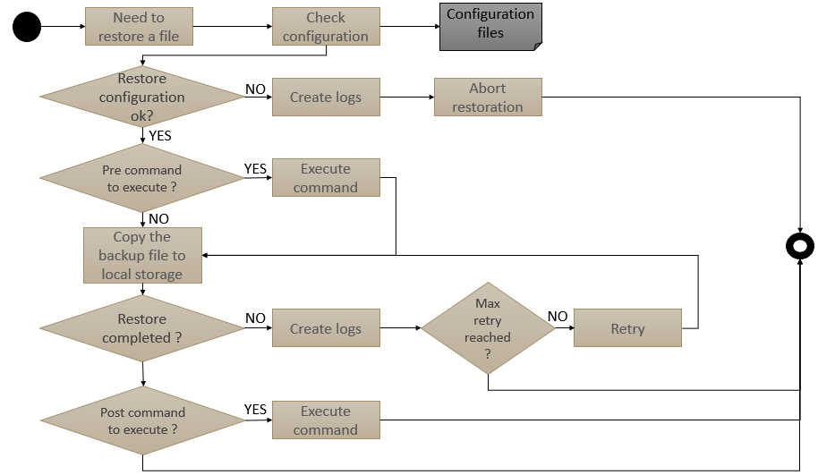

# Interface Control Document

## Document properties

|    |   |
| -: | - |
|    **Reference** | : CSGF-CSC-RS-PRD-ICD-INF |
|        **Issue** | 2 |
|   **Issue date** | 16 Sep 2022 |
|  **Prepared by** | **Cyrille BOUISSON**  *(Architect / Technical Manager)* |
|  **Approved by** | **Jonathan TAGLIONE** (Quality Manager) + **Nicolas Leconte** (Technical Manager) |
|  **Released by** | **Stéphane HURIEZ** (Project Manager) |
|     **Doc type** | SCF |
|       **No WBS** | WP-3000-C |

## Document Summary

This document is the Interface Control Document for Infrastructure of Reference System. This document will be completed all along the software development lifecycle.

## Document Change log

| Issue/Revision | Date | Change Requests | Observations |
| :------------: | :--: | --------------- | ------------ |
| 1 | 01 Mar 2022 | | v1.0.0   First issue of document |
| 2 | 16 Sep 2022 | | v1.1.0 |

## Table Of Contents

- [Interface Control Document](#interface-control-document)
  - [Document properties](#document-properties)
  - [Document Summary](#document-summary)
  - [Document Change log](#document-change-log)
  - [Table Of Contents](#table-of-contents)
  - [Introduction](#introduction)
    - [Scope](#scope)
    - [Applicable and Reference Documents](#applicable-and-reference-documents)
      - [Applicable documents](#applicable-documents)
      - [Reference documents](#reference-documents)
    - [Glossary](#glossary)
  - [Software overview](#software-overview)
  - [Requirement and design](#requirement-and-design)
    - [General provisions to the interface requirements](#general-provisions-to-the-interface-requirements)
    - [Interface requirements complementary definition](#interface-requirements-complementary-definition)
    - [Interface design](#interface-design)
      - [Backup and Restore interface design](#backup-and-restore-interface-design)
        - [General](#general)
          - [Reference System](#reference-system)
          - [Key drivers](#key-drivers)
        - [Backup needs](#backup-needs)
          - [Backup configuration](#backup-configuration)
          - [Backup operations](#backup-operations)
        - [Restore needs](#restore-needs)
          - [Restore configuration](#restore-configuration)
          - [Restore operations](#restore-operations)
  - [Validation requirements](#validation-requirements)
  - [Traceability](#traceability)

## Introduction

The Interface Control Document (ICD) describes the interfaces that must be respected by external services that want to integrate an application into the system.

This document is based on the ECSS Template of the ICD.

It is completed all along the software development lifecycle.

### Scope

The Interface Control Document is applicable to the Reference System Project.

### Applicable and Reference Documents

#### Applicable documents

| Reference | Issue no | Title of document |
| --------- | :------: | ----------------- |
| COPRS-ICD-ADST-001146319 | 1.0 | Interface Control Document Reference System backup and restore |

#### Reference documents

| Acronym | Reference   | Issue no | Title of document |
| :-----: | :---------: | :------: | ----------------- |
| SVVD COPRS | CSGF-CSC-RS-TST-SVVD-INF | 2 | Software Verification and Validation Test Document |

### Glossary

| Term | Definition |
| ---- | ---------- |
| ECSS | European Cooperation for Space Standardization |
| ICD | Interface Control Document |

## Software overview

The Copernicus Reference System Service is the key component of the CSC Ground Segment. It provides an open source and versatile capacity to integrate and validate new Sentinel Data Processors and therefore to improve performances of the system.

Moreover, the service is able to substitute temporarily the nominal Production and Distribution services with a high-demanding level of service.

Finally this service environment brings a new mind-set in the development based on an open source community to reinforce the adoption and attractiveness of Sentinel data.

## Requirement and design

### General provisions to the interface requirements

Not applicable

### Interface requirements complementary definition

Not applicable

### Interface design

To be able to integrate the system, a new component must comply with the following ICDs:
- to backup and restore its critical data

#### Backup and Restore interface design

##### General

###### Reference System

The Copernicus Reference System executes Sentinel 1, Sentinel 2 and Sentinel 3 image processing workflows.
During the execution of this system, essential data - like users database or monitoring traces - is generated and stored on local filesystems or persistent volumes. In order to prevent issues with these storage means and contingency, a proper mechanism of data backup needs to be implemented, along with the proper mechanism to restore data to retrieve data.
As we are executing the Copernicus Reference System in a public cloud, this document give a definition of the backup and restore interfaces to implement in order to perform data storage and retrieval actions.
The definition of the interface focuses on important/critical data that each application or service hosted on the system (Kubernetes cluster) needs to backup and restore in order to guarantee a good or even nominal level of performance.
Consequently, this document targets only stateful services and applications, so the mechanism of backup and restore will not be present everywhere in the system.
In the context of Copernicus Reference System, there is no need to backup static data such as images of containers or virtual machines as they will be managed through specific repositories. The same way, the images produced by the system and published for external users are not in the scope of this backup and restore interface definition.

###### Key drivers

The implementation of the backup and restore solution shall respect the following key drivers:

- Limit or avoid impact on system performance
  - The operation of executing a data backup shall not prevent the system to operate and to process data with the right level of performance and monitoring and control.
  - The operation of executing a data restore shall not prevent the system to operate and to process data with the right level of performance and monitoring and control.
- Guarantee data consistency
  - Data to be saved in a backup file shall remain consistent to all the information elements used in the system.
  - Data restored from a backup file shall be consistent with other information elements used in the system.
  - Data stored in backup files shall be protected in terms of access and integrity.
- Enhance configuration items
  - The solution to backup data shall be configurable by an operator in terms of execution time, data selection, file location, type of backup (incremental/full) and policy of historic to keep.
  - The solution to restore data shall be configurable by an operator in terms of execution time, backup file selection, file location .
- Ease integration inside the system
  - The solution to backup and restore data shall be compliant with cloud technologies, especially kubernetes.
  - The solution to backup and restore data shall send monitoring metrics and logs coherent with the monitoring solution.
  - The solution to backup and restore data shall execute automatically and independently based on a configuration.

##### Backup needs

For the Copernicus Reference System, we need to guarantee the following cases:

1. Registered users of the system are not lost/deleted during the system operations.
2. All monitoring information used to compute performance remains available.
3. It is possible to perform a security analysis on live data over the last month, and on stored data – i.e. data that can be retrieved in a controlled time window – for the last 6 months.

In order to cover these needs, the implementation needs to respect the definition of interface
described below.

###### Backup configuration

The following elements shall be configured before execution of the first backup operations.

| Element | Type | Default Value | Description | Mandatory |
| ------- | ---- | ------------- | ----------- | --------- |
| **BACKUP FILE LOCATION** | FILEPATH | /usr/local/backup | Path of the file to backup | Y |
| **TARGET** | URL | S3://mybucket | Bucket where backup files are stored | Y |
| **EXECUTION TIME** | CRON | 0 4 * * * | Time when execution of backup will occur | Y |
| **MODE** | BOOLEAN | 0 | 0 for FULL; 1 for INCREMENTAL | Y |
| **RETENCY POLICY** | NUMBER | 7 | Max number of replicas | N|
| **PRE BACKUP COMMANDE** | TEXT | $BACKUPFILELOCATION/prepare_backup.sh | The command/script/executable to run to get a backup file. | N (but recommanded) |
| **POST BACKUP COMMAND** | TEXT | $BACKUPFILELOCATION/complete_backup.sh | The command/script/executable to run to clean after a backup. Can include integrity check and compression.| N |
| **CHECKSUM** | SHA512 | N/A | Checksum of the file for integrity checks | N |
| **COMPRESS** | BOOLEAN | 0 | 0 for uncompress; 1 for compressed | N |

###### Backup operations

For every application or service in the scope of this backup mechanism, the following concept of operations shall be respected.

##### Restore needs

In the event of a major issue, the restore of a backup file is supposed to be managed through an operations procedure.
The starting event is so the decision for an operator to process the restoration of a data from a backup file.

###### Restore configuration

The following elements shall be configured in order to restore a backup file.

| Element | Type | Default Value | Description | Mandatory |
| ------- | ---- | ------------- | ----------- | --------- |
| **TARGET** | FILEPATH | /usr/local/backup | Path where the backup file needs to be placed for restoration | Y |
| **SOURCE FILE** | URL | S3://mybucket/filename | Bucket where backup files are stored | Y |
| **PRE RESTORE COMMANDE** | TEXT | $BACKUPFILELOCATION/restore_backup.sh | The command/script/executable to run to restore a backup file. Can include integrity check and uncompression. | Y |
| **POST RESTORE COMMAND** | TEXT | $BACKUPFILELOCATION/complete_restore.sh | The command/script/executable to run to clean after a restore. | N |
| **CHECKSUM** | SHA512 | N/A | Checksum of the backup file for integrity checks | N |

###### Restore operations

## Validation requirements

The validation approach is described in document [ SVVD COPRS ]

## Traceability

Not applicable