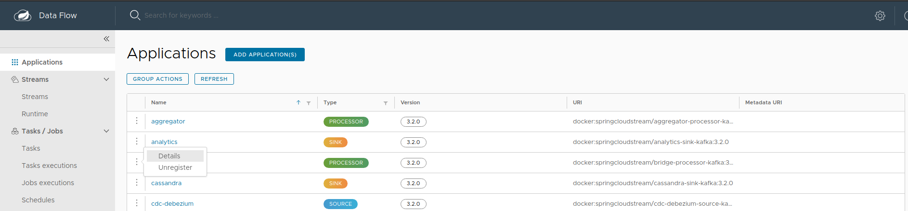

# RS Add-on / RS Core

## Deploy

> Compliant with the COPRS ICD

 - Upload the RS Addon/RS Core zip file to the artifactory or have it on the bastion
 - Run the `deploy-rs-addon.yaml` playbook with the following variables:
   - **stream_name**: name given by *Spring Cloud Dataflow* to the created stream
   - **rs_addon_location**: direct download url of the zip file or zip location on the bastion

For example:
```shellsession
ansible-playbook deploy-rs-addon.yaml \
    -i inventory/mycluster/hosts.yaml \
    -e rs_addon_location=https://artifactory.coprs.esa-copernicus.eu/artifactory/demo-zip/demo-rs-addon.zip \
    -e stream_name=STREAM_NAME \
    -e stream_namespace=NAMESPACE
```

## Use different namespaces in stream deployments

In order to allow the **Spring Cloud Dataflow Skipper** to deploy a stream in any chosen namespace, you must set up the namespaces you want available in the `host_vars/setup/apps/spring-cloud-dataflow.yaml` inventory file before deploying SCDF:

```yaml
scdf:
  [...]
  namespaces:
    - processing
    - monitoring
    - ...
```

You will then be able to choose the namespace you want the stream to be deployed into by using the `-e stream_namespace=NAMESPACE` option on stream deployment.


## Uninstall

> **Use IHM**

### Destroy stream


If the stream was deployed, it is undeployed before the stream definition is deleted.

> Often, you want to stop a stream but retain the name and definition for future use. In this case, you **undeploy** a stream

### Unregister applications

> NOT MANDATORY

When you destroy a stream, you can also unregister applications of this stream.



> Not unregister applications when only undeploy a stream

### Additionnal resources

Not necessary
