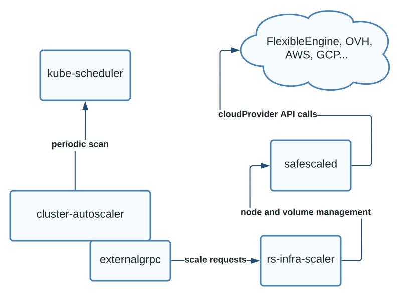

# Expand a node group


> Keep in mind that the only ansible variables actually used are the ones in the `generated_inventory_vars.yaml` file and you can directly edit this file, retrieve it from a vault, upload it to a vault etc, see the [Credentials.md](./Credentials.md)

> Your node groups must be correctly configured, see [Cluster configuration](./Cluster%20configuration.md)

1. Add nodes to a node group

```shellsession
ansible-playbook cluster.yaml -i inventory/mycluster/hosts.yaml -t expand,update_hosts -e expand_nodegroup_name=NODEGROUP -e expand_count=N
```

2. Set up Reference System settings and security on the nodes

```shellsession
ansible-playbook  cluster.yaml -i inventory/mycluster/hosts.yaml -t config --limit=CREATED_NODE1,CREATED_NODE2,...
ansible-playbook security.yaml -i inventory/mycluster/hosts.yaml -b --limit=CREATED_NODE1,CREATED_NODE2,...
```

3. Add the nodes to the kubernetes cluster with kubespray

```shellsession
ansible-playbook collections/kubespray/cluster.yml -b -i inventory/mycluster/hosts.yaml --limit=CREATED_NODE1,CREATED_NODE2,...
```

4. Set up the providerID spec on the nodes for the autoscaler

```shellsession
ansible-playbook cluster.yaml -i inventory/mycluster/hosts.yaml -t providerids
```

> If the created node has the affinities corresponding the the Ceph Cluster and a mounted volume, a new OSD will be created on this node, this is how you may scale the storage on the platform.

# Delete nodes from the cluster

> To downscale the `rook_ceph` cluster, first mark the OSDs corresponding to the node as **out** of the Ceph Cluster so the data is first removed from the OSDs.

1. Drain and delete the nodes from the kubernetes cluster

For each node, run:
```shellsession
ansible-playbook collections/kubespray/remove-node.yml -i inventory/mycluster/hosts.yaml -b -e skip_confirmation=yes -e reset_nodes=false -e node=NODE_TO_DELETE
```

2. Delete nodes from the cloud provider
```shellsession
ansible-playbook cluster.yaml -i inventory/mycluster/hosts.yaml -t shrink,update_hosts -e nodes_to_delete=NODE_TO_DELETE1,NODE_TO_DELETE2,...
```

# Autoscaling

## How the autoscaler works

The autoscaling on Reference System relies on the following components:
 - the [cluster-autoscaler](https://github.com/kubernetes/autoscaler/tree/master/cluster-autoscaler) for scaling decisions
 - the *rs-infra-autoscaler* that implement the [externalgrpc](https://github.com/kubernetes/autoscaler/blob/master/cluster-autoscaler/cloudprovider/externalgrpc/README.md) service for cluster management
 - [safescale](https://github.com/CS-SI/SafeScale) for cloud provider management

These components interact in the following way:



## Configure the autoscaler

### Cluster autoscaler internal settings

The main settings for the cluster-autoscaler are set as command line parameters in the `apps/autoscaling/cluster-autoscaler.yaml` file, you may want to tune some parameters that are described [here](https://github.com/kubernetes/autoscaler/blob/master/cluster-autoscaler/FAQ.md#what-are-the-parameters-to-ca).

### Cluster autoscaler deployment configuration

Write your SafeScale tenants configuration with only the tenant corresponding to the cluster to scale in the `apps/autoscaling/safescaled-tenants.yaml`

## Deploy the autoscaler on a running cluster

1. Rewrite the cluster configuration

Following [./Cluster%20configuration.md](./Cluster%20configuration.md), write the cluster configuration matching the running cluster. You can add some empty node groups to expand later.


2. Create the label corresponding to the node groups

```shellsession
safescale label create CLUSTER_NAME-nodegroup --value unset
```

3. Label the running hosts with the right node group label
For each node:
```shellsession
safescale host label bind NODE CLUSTER_NAME-nodegroup --value NODEGROUP
```

4. Update the `hosts.yaml` inventory file
```shellsession
ansible-playbook cluster.yaml -i inventory/mycluster/hosts.yaml -t update_hosts
```

5. Set up the providerID spec on the nodes for the autoscaler

```shellsession
ansible-playbook cluster.yaml -i inventory/mycluster/hosts.yaml -t providerids
```

6. Deploy the autoscaling components

```shellsession
ansible-playbook apps.yaml \
    -i inventory/mycluster/hosts.yaml \
    -e app=autoscaling
```

## Migration from 0.8.0 to 0.9.0

Since release 0.9.0, the node group (and therefore the scaling) functionnality relies on the SafeScale label and no more on the SafeScale tags. Also, there has been a change in the metadata, so you must remove all tags from the 0.8.0 cluster, using the same SafeScale build used to write them.

You may use a script like the following to remove tags from the hosts for each node group:
```shellsession
for host in $(safescale tag inspect NODEGROUP | jq -r '.result.hosts[].name'); do safescale host untag $host NODEGROUP ; done
```

And then remove the actual node groups:
```shellsession
for tag in $(safescale tag list | jq -r '.result[].name'); do safescale tag delete $tag ; done
```

After that, follow the updated procedure above to deploy the node groups.


## Prevent the autoscaler from scaling a particular node

To prevent the cluster-autoscaler from deleting a given node, annotate it:
```shellsession
kubectl annotate node NODE_NAME cluster-autoscaler.kubernetes.io/scale-down-disabled=true
```

## Monitor the autoscaler

The cluster-autoscaler exposes metrics that are periodically retrivied by prometheus, you can use for example the grafana dashboard [3831](https://grafana.com/grafana/dashboards/3831) to visualize them.
